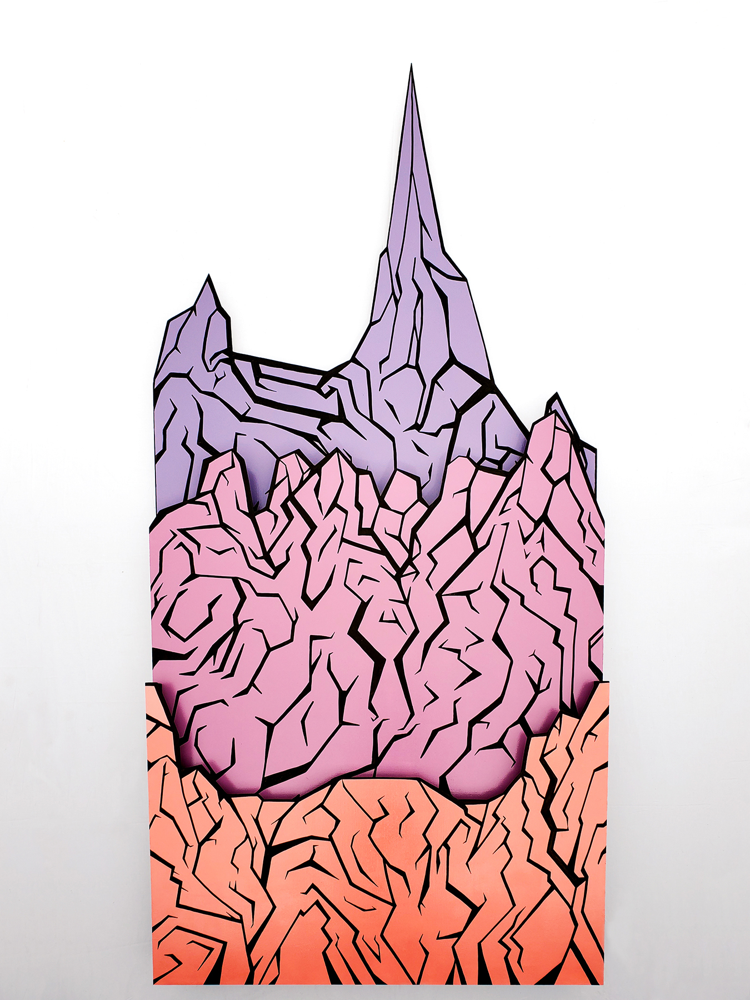
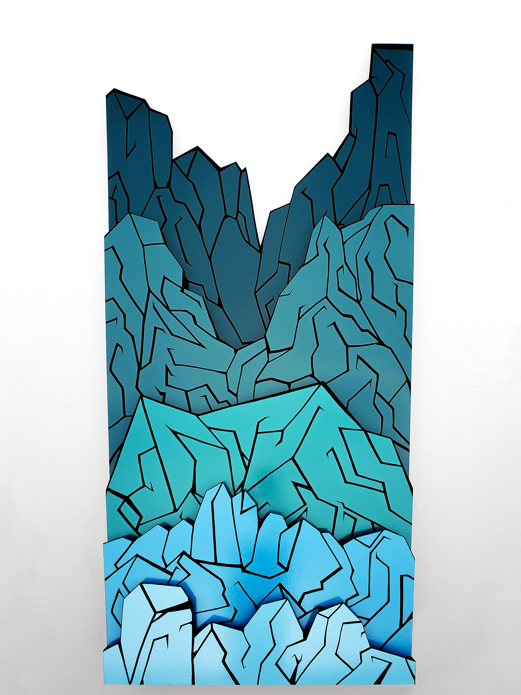
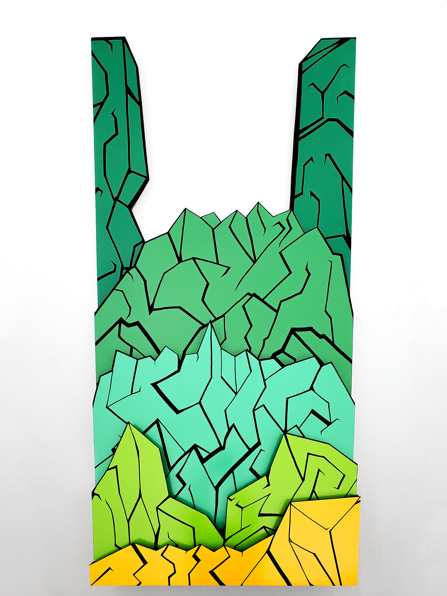

### The question I have the hardest time answering, is one I am asked almost daily: “Where are you from?”

My mother is Argentine, my father is American, and I was born in Mexico City. Throughout the twenty-two years of my life, my family has moved often, living in seven different homes across Mexico, France, Belgium and the United States. As I am an amalgamation of all the different environments that contributed to me becoming the person I am today, Memoryscapes stands as a visual representation of the multifaceted relationships I keep with my past and present homes.

Brussels 72" x 36" x 5.625"

By focusing on my lived experiences and my conceptions of memory I am able to accurately, through a lens of abstraction, represent my relationships with these homes. Each object’s design and appearance is influenced by, and characteristic of, the home it represents.

Philadephia 72" x 36" x 8.75"

The mountain form is derived from photographs, with strong memories or emotions attributed to them, that were taken at the corresponding home. The peak’s shape is derived from its respective image by drawing a continuous line that traces the prominent features within the photo. When viewed together, the aesthetically different pieces assemble a visually uniform landscape representing some of the homes of my life.

Kensington 72" x 36" x 5.625"

I chose mountain ranges to be the subject matter of this series because as symbols of permanence, they best represent the everlasting nature of the emotional associations I’ve connected with my homes. By using gradations of colors and varied line weights across panels, I indicate shifts in my emotional state over time in that place. Likewise, the number of panels serve to indicate how long I’ve considered that place a home. As such, the mountains symbolically become homes because the memories and emotions I have imparted upon them live on, even if I never return to the physical place.

Camp Arrowhead 72" x 36" x 8.75"

