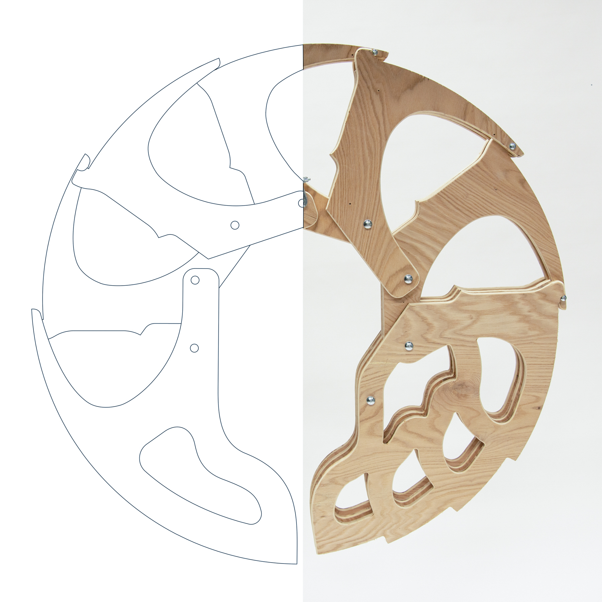
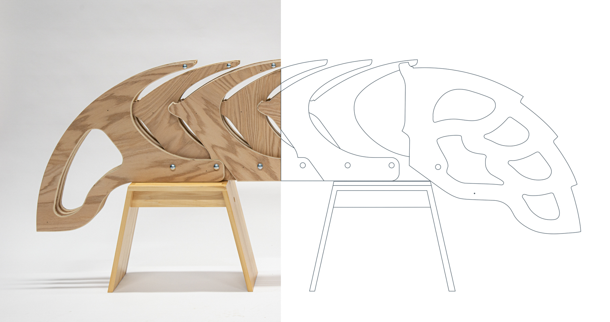
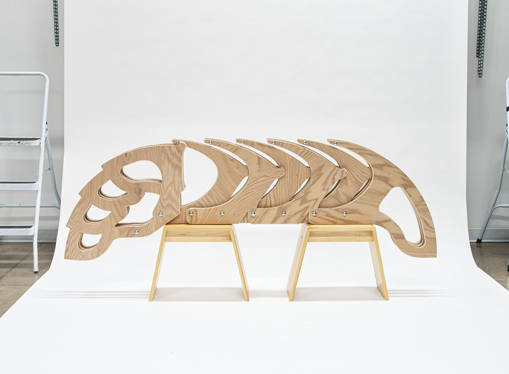
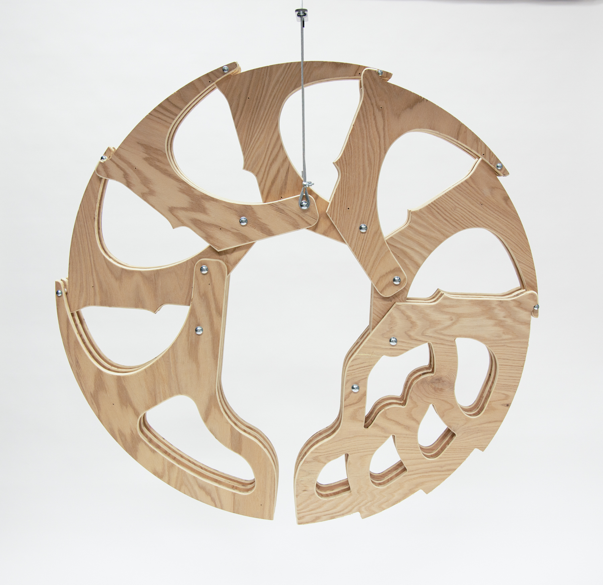
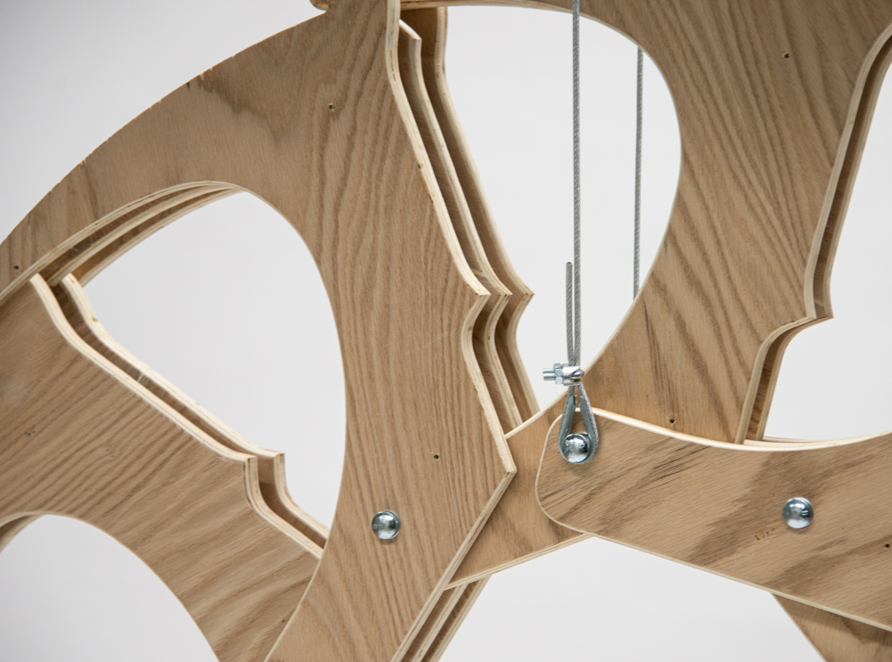
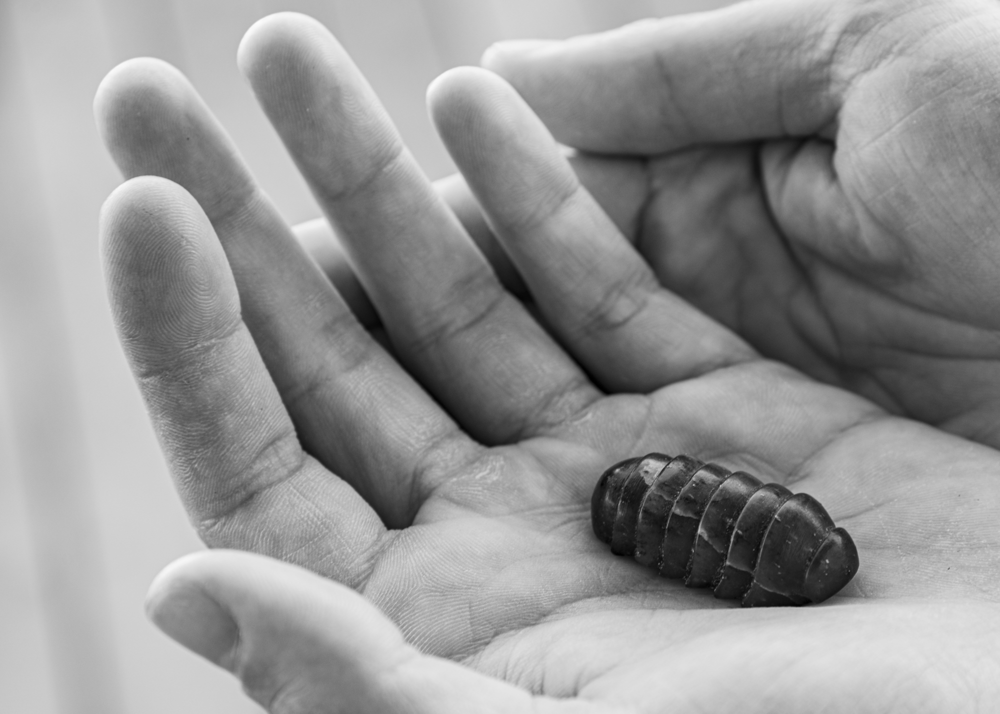
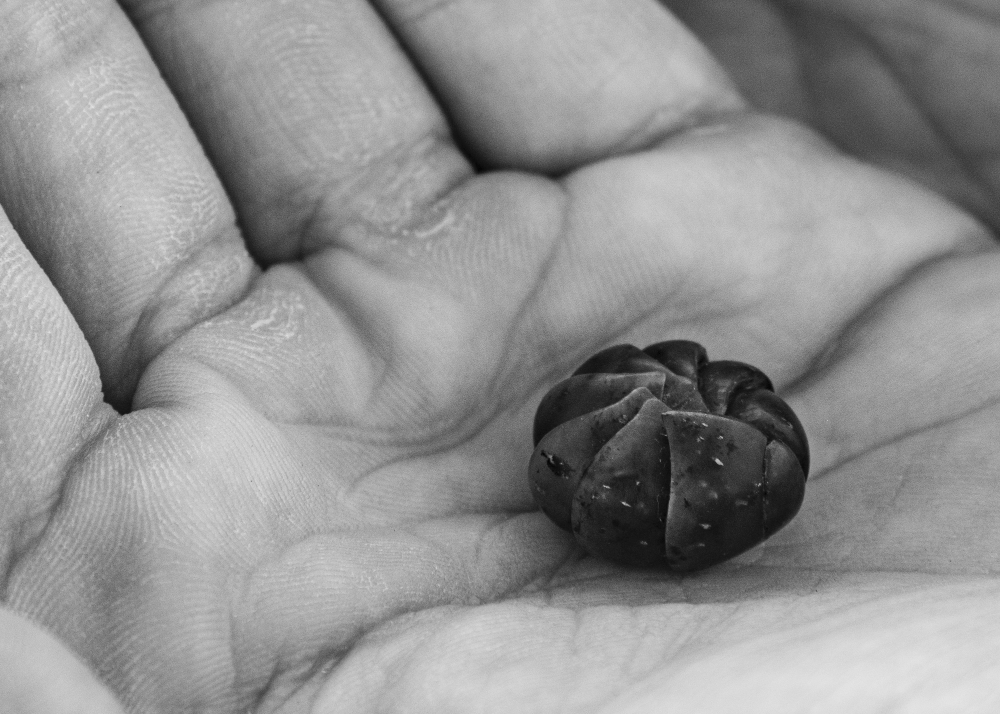
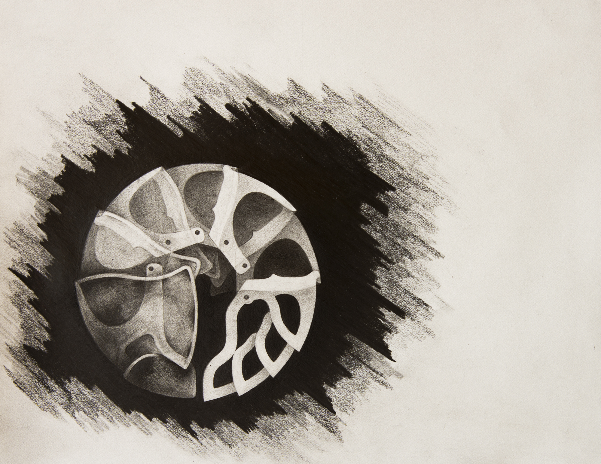

### When I was young, I, like many others, was fascinated by roly-polys.

I have distinct memories of my younger self overturning loose rocks around my yard, and marveling at the miniature transformers shapeshifting from their natural orientation to a seemingly impenetrable armored sphere.

But the far more impactful moment for me was when I gently picked up an individual roly-poly, then slowly opened my palm such that the creature could see that I meant no harm. After a brief, motionless pause, the Armadillidiidae would then unroll.

Their appealing physical ability seems to catch the eye of many; in self-defense, the small isopod can roll itself into a perfect little ball, protecting its vulnerable underbelly with a hard, spherical shell, then from this act they re-emerge slowly. Its two hair-like antennae would emerge first from the tiny crack between the head and tail, soon followed by the fourteen legs as the inanimate ball returned to life, with a movement pattern that impossibly seems simultaneously organic and engineered. This encounter is an intimate moment between two seemingly incompatible species. Even as a small child, my human form stood thousands of times larger than the Armadillidiidae. My warm blooded, fleshy body, with an endoskeleton, red blood, and complex mammalian brain, looked and functioned nothing like the tiny, grey, six-legged, crustacean in my hand and yet, somehow, a brief moment of communication and trust occurred.

My goal with my artwork is an attempt to recreate these childhood moments such that they may be experienced by adults with the same degree of excitement and wonder experienced by my childhood self. By bringing the roly-poly to an exaggerated adult scale, I hope to inspire this sort of childlike play and interaction with a creature that is often overlooked and forgotten by adults, and remind people of how we are intimately connected with our natural world in hopes to inspire them to love and protect it.

