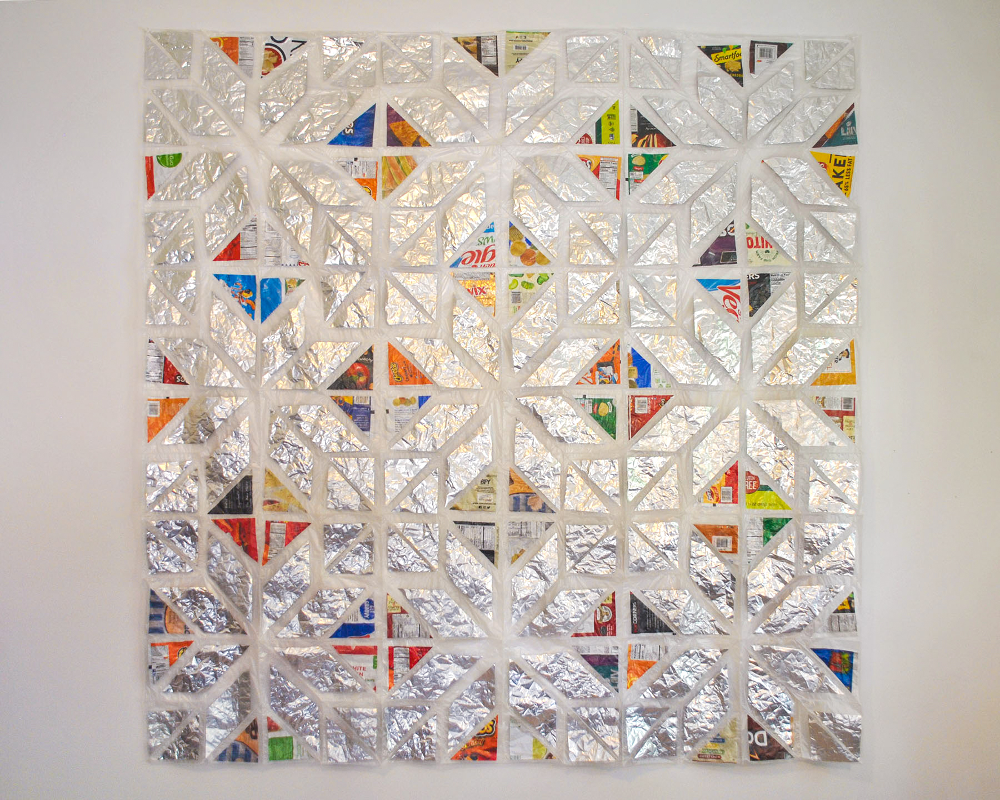
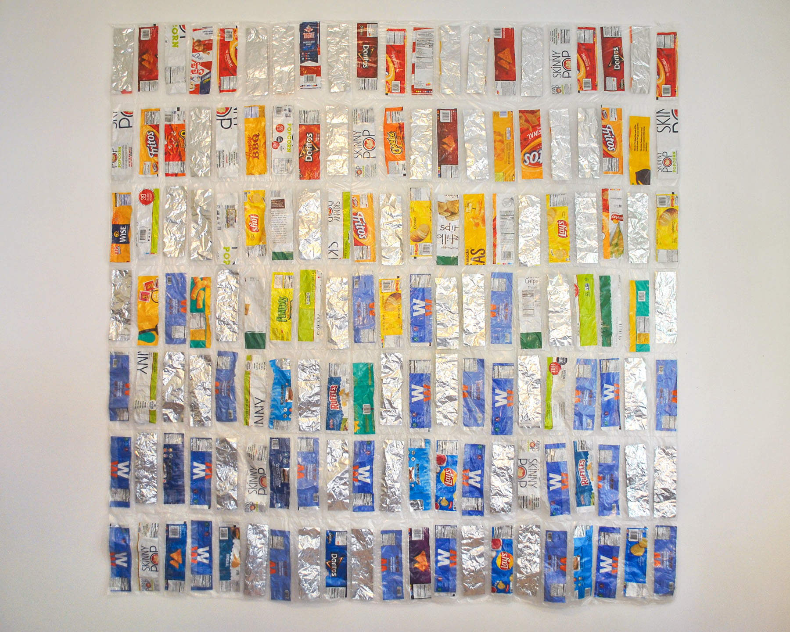
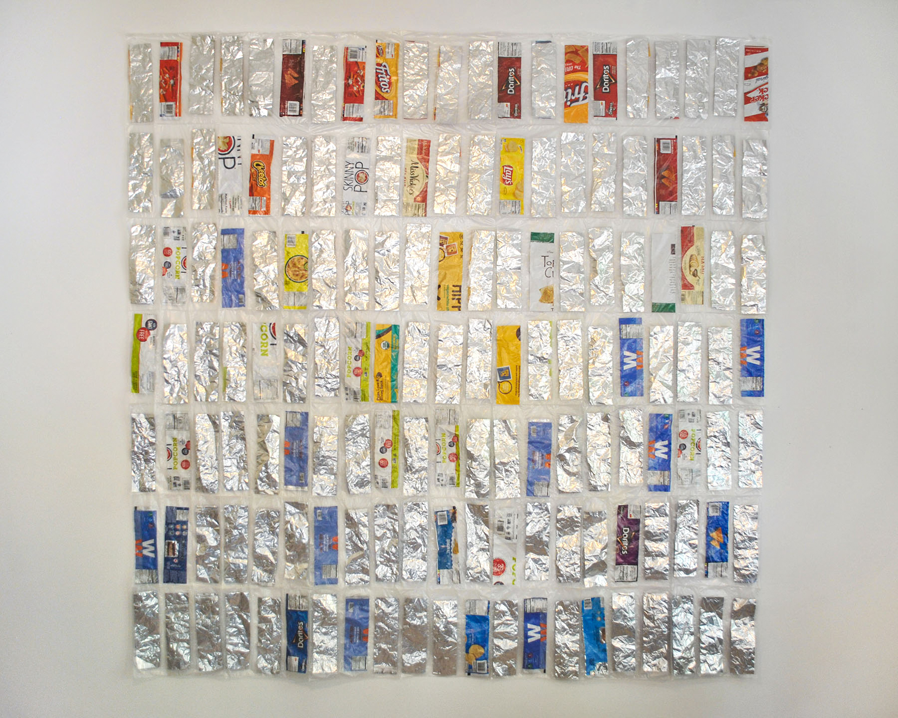
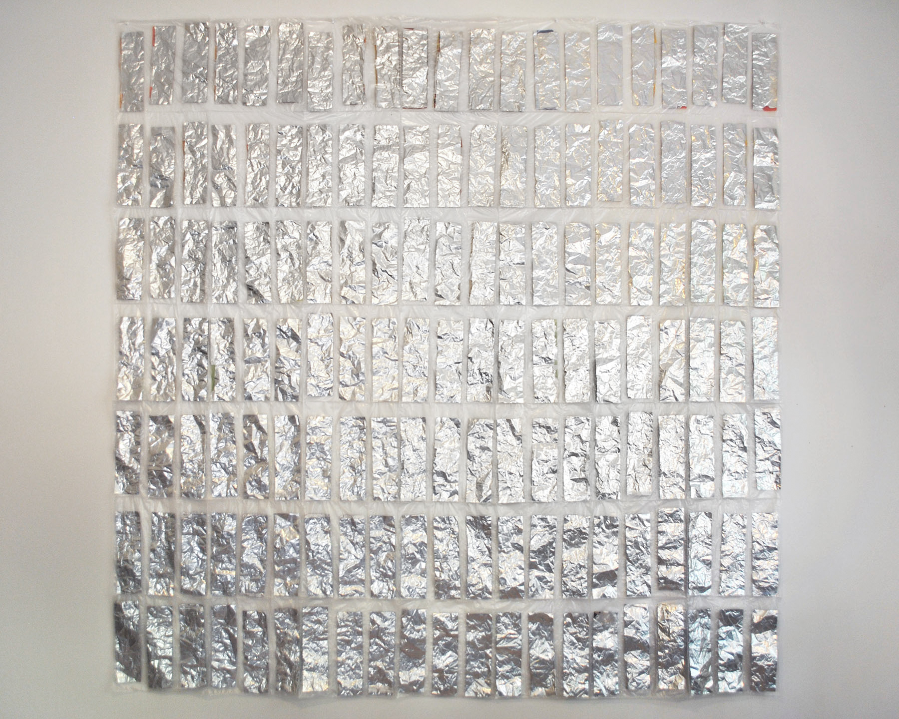
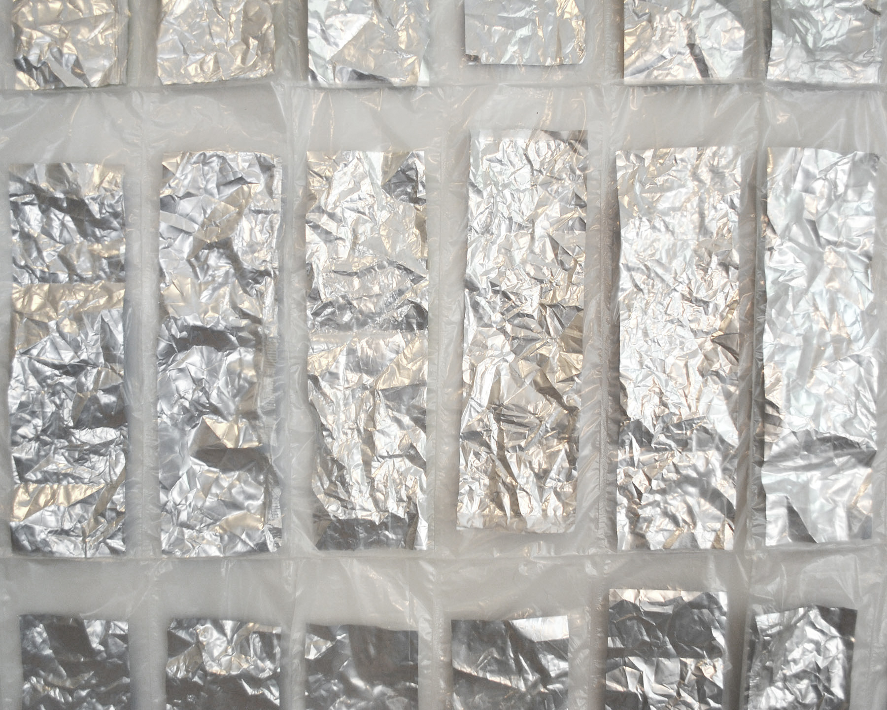
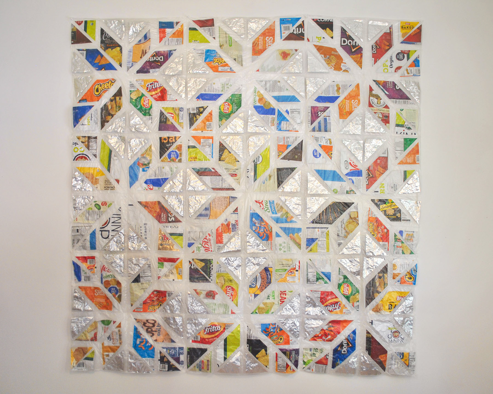

### During the past year, I have become increasingly interested in what it means to care, particularly in relation to people and to the climate crisis. What can care look like as an action, an object, or a feeling?

Through developing these works, I learned many different answers to this question. Kenyon community members practiced care in paying attention to the waste that they were generating and collecting the waste with a metallic lining, which is most often food wrappers. I found a strange sense of care in washing and cutting the metallic lined food containers and discarded plastic recycling bags. The act of assembling the quilts, and the time it took, resemble the time of care, in that a repetitive yet finite action produced an enduring result.

Finally, the completed quilt forms embody the care which produced them while referring to quilting traditions throughout history, from the personal care in family quilts to the more wide-reaching activist care in quilts like the AIDS quilt and Faith Ringold’s story quilts. These works act as objects of care in the climate crisis, preserving waste in order to draw attention to it, and asking viewers to reflect on their own ways of responding to the climate crisis.

