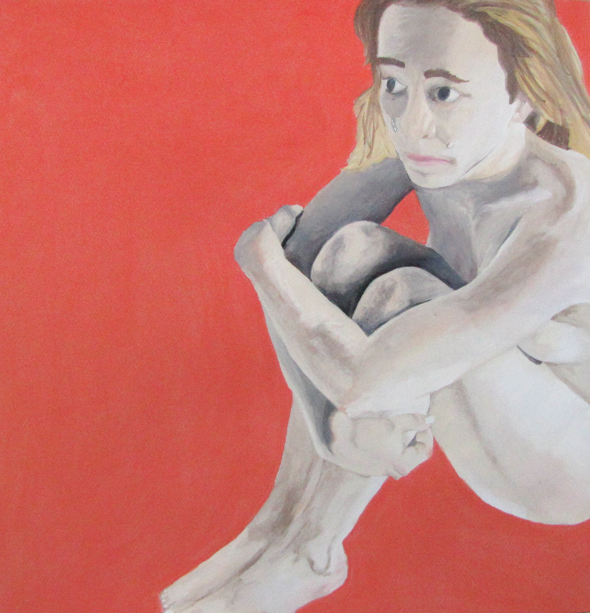
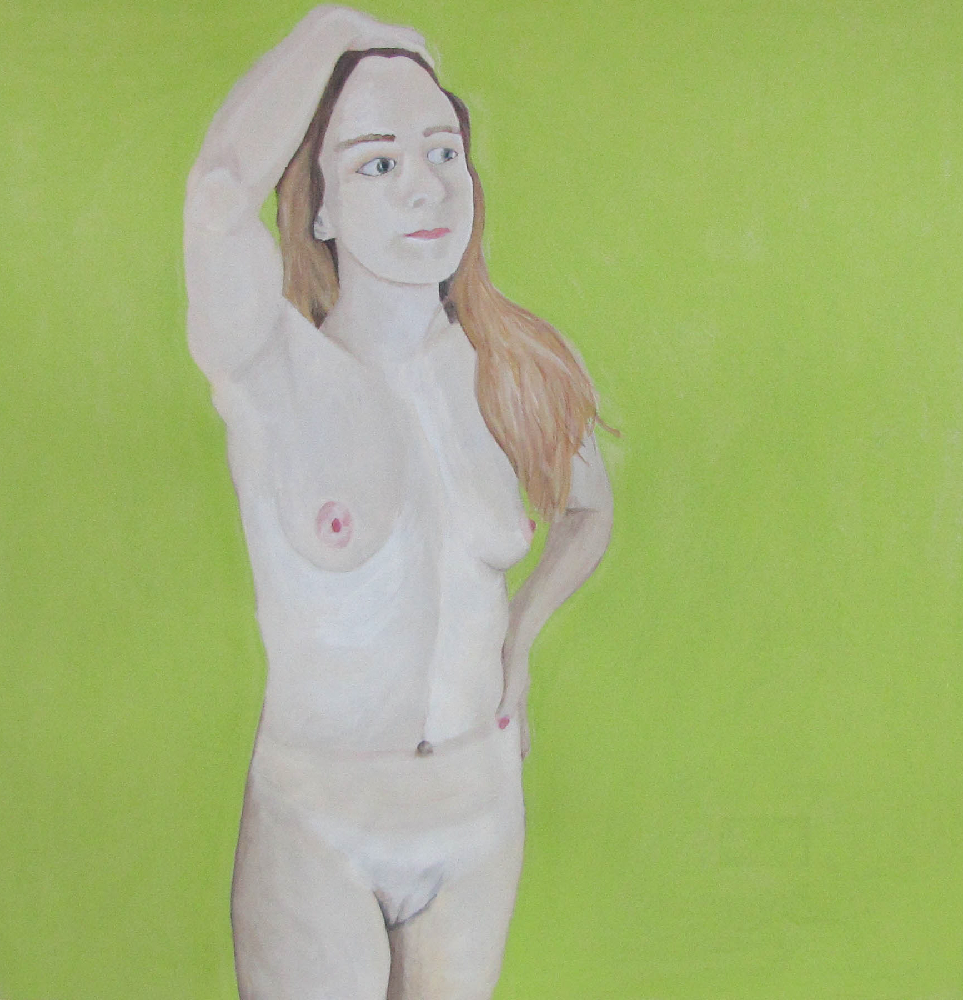
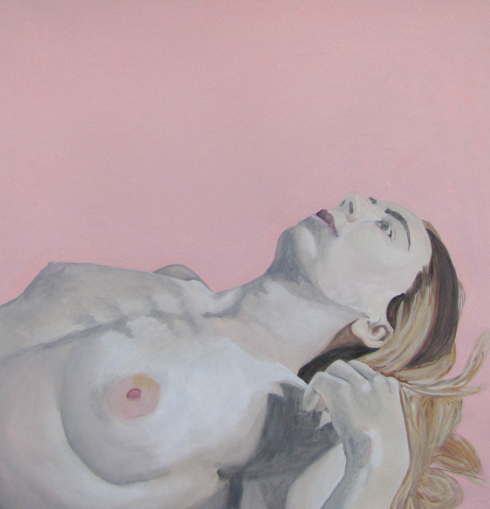
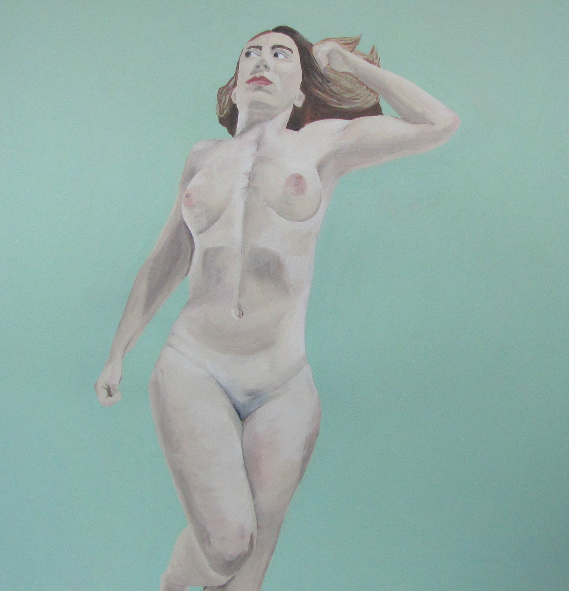

### _“I will not tame my spirit and the way it howls”_   — L.E. Bowman

My body is not for you, I don't know why you taught me that, and I am still relearning.

This collection of drawings of the female figure exemplifies the process of growth coming out of a place of psychological entrapment, into one that is free. The product of negative and limiting verbal conditioning is an internal voice that causes doubt in one’s own abilities and cripples confidence. *I feel inadequate. I feel incapable. I feel lost.* Another’s voice has become your own. Creating art has allowed me to explore myself as an autonomous being, as well as become an outlet to work through the inconsistency between my own ingrained, inherited voices, and the ones I want to hear, to adopt, to become.

I see the figure as the most direct way of both showing and viewing mental states--the embodiment of thoughts. This figure has become vulnerable to you, telling her story. In these images, there are facial expressions and body language to be read. She is alone with herself, free of any influence, finding power in finding herself, experiencing the peace in unapologetic genuity.

Do you see her differently now that she has become vulnerable in front of you? That’s what she was afraid of. That’s what everyone is always afraid of.
