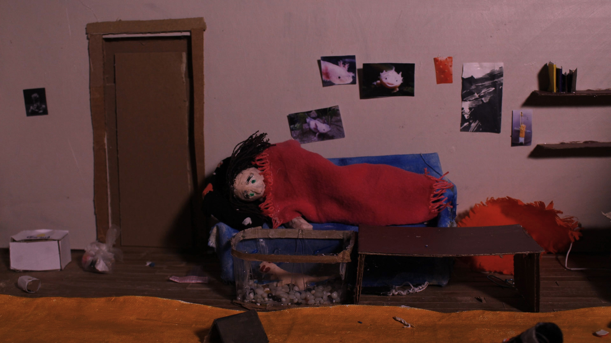
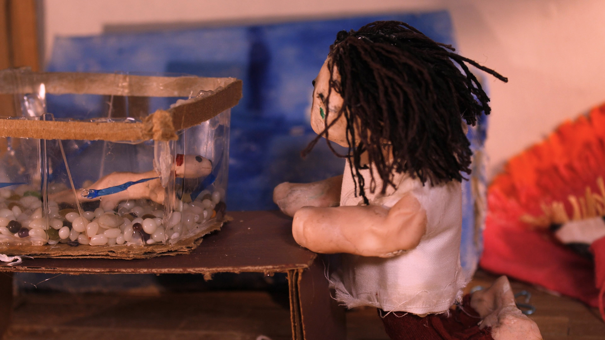
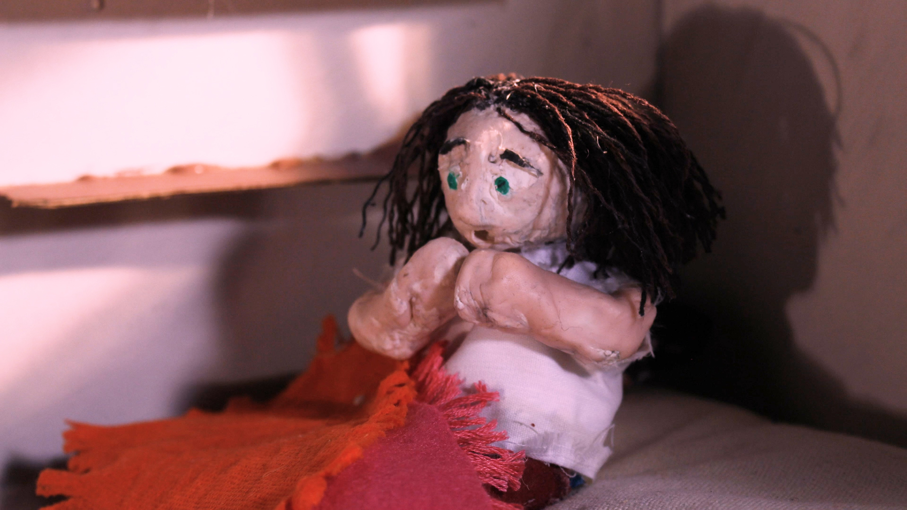
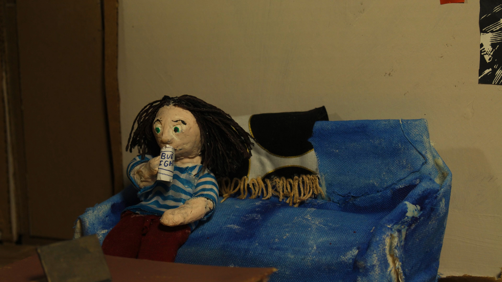
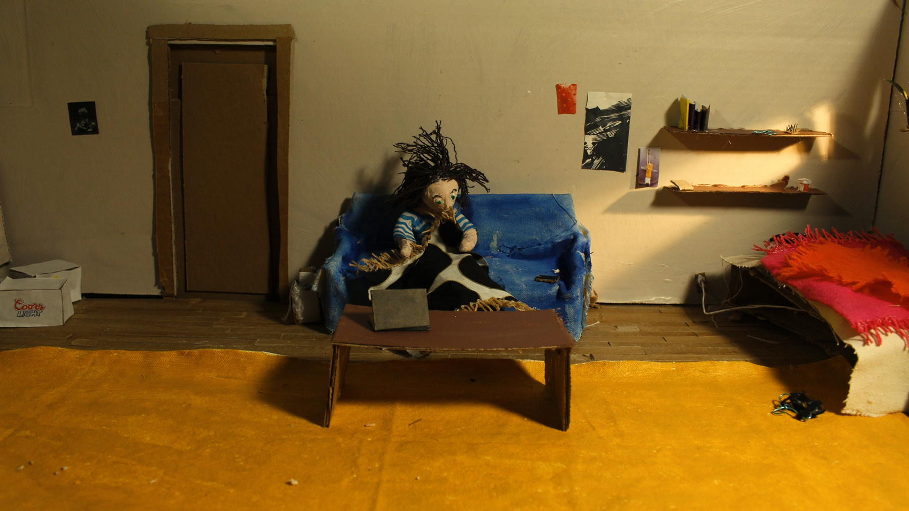

### The fairly simple story told here highlights the normalcy of the internal feelings experienced by the character.

`video: https://vimeo.com/412362971`

In my understanding of my own experiences and my observations of those close to me, the lived experiences of those with trauma or severe mental health struggles is not one that constantly depicts the cruelty experienced by the individual but rather is much more subtle in the way the pain becomes a normal part of life.

Rarely is the day-to-day struggle as dramatic or external than the typical media portrayal. Through this piece, I am considering ways to represent trauma and mental health struggles that do not also actively show violence or cruelty.

The isolation experienced by the character is an isolation that I see people experience very often and is often a way to avoid underlying, internal issues. In our current situation with Covid-19, isolation has become enhanced which only emphasizes this story’s connection with our emotional realities.

However, this isolation is not all that new, it is just more apparent and aggressive. While my work offers no solution to these feelings, it does offer a reflection with which to gain a slight understanding into the ways in which we handle these painful situations.

