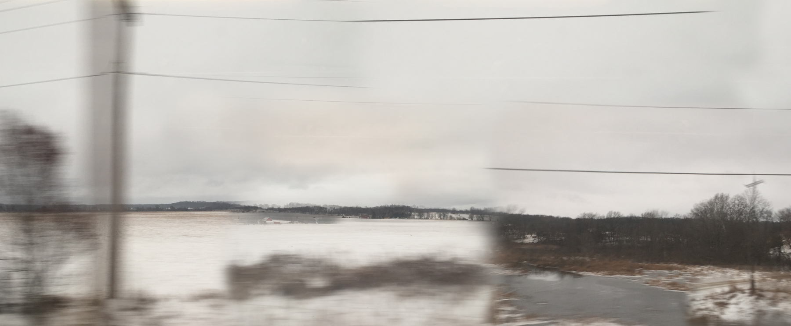
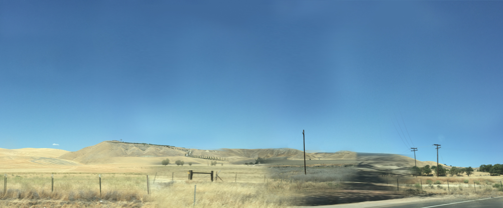
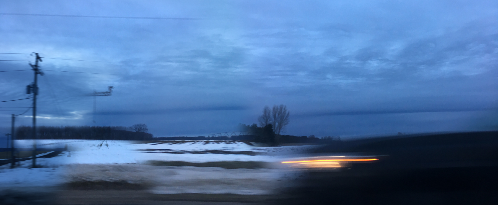
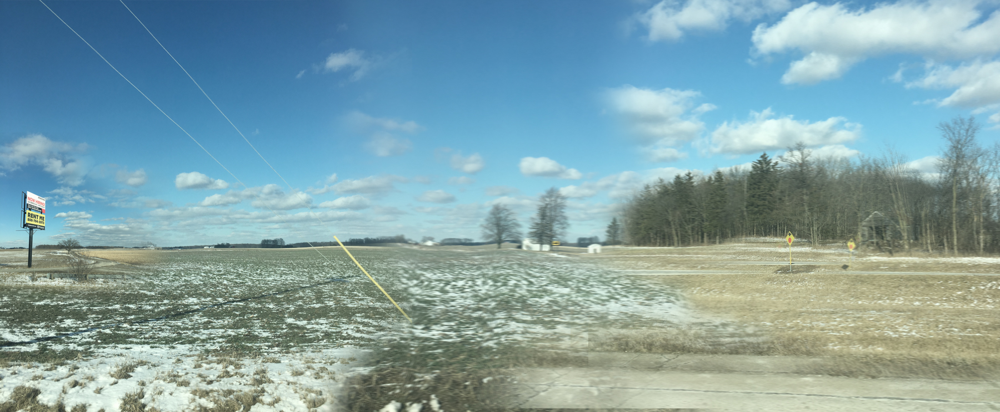
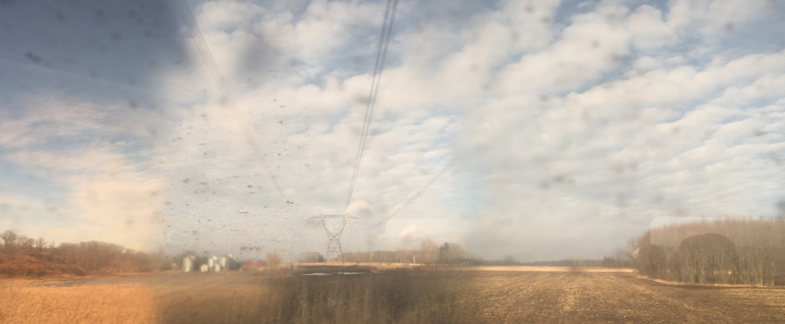

### The neuroscience theory “multiple trace” posits that every time a memory is recalled, neural pathways are activated in this act of remembering, creating new pathways and necessarily changing the nature of that memory. An experience can never be remembered the same twice.

Chicago / Ann Arbor 40" x 16.5"

The photographs in _multiple trace_ document the rhythm and color of the landscapes making up the transitory paths between places that I’ve frequented. Holding my camera to the car window, I attempt to capture the vast spaces between cities as well as the time, sometimes considered wasted, out on the road. I approach similar subjects in various locations: powerlines, housing developments, geological features. To mimic the compression and distortion of time and space in memory, I select photographs from different moments of the drive and weave them together digitally. By printing the panoramas on transparencies, I hope to convey the ephemeral nature of these memories. Various views overlap and coalesce into a more comprehensive, impressionistic representation of the passage in between meaningful locations. By embracing motion blur, foggy windows, and vibrations, I attempt to convey the experience of seeing through the lens of a car and immerse the viewer in the perspective of a particular, fleeting time and place. These panoramic views emulate the horizontal experience of traveling long distances on the road and elicit what this horizontality represents to me: peace and stability, transition, and continuity.

Los Angeles / Carmel 40" x 16.5"

Addressing the unique ability of photographs to halt time, Roland Barthes refers to cameras as “clocks for seeing;” the resulting photographs being visual documents of time passing. Each stitched-together frame creates part of a memory, a scatterplot timeline of sorts. Much as memories can never be accurately re-lived, I can never take these same photograph again. Remembering an event and photographing an event are both instances of fabrication, in which facts and places are subjectivized and changed. The projection of these images onto the wall is a visualization of how a memory might be repeated even as it is made less distinct by the very act of recalling.

Ann Arbor / Traverse City 40" x 16.5"

Gambier / Ann Arbor 40" x 16.5"

Ann Arbor / Chicago 40" x 16.5"

