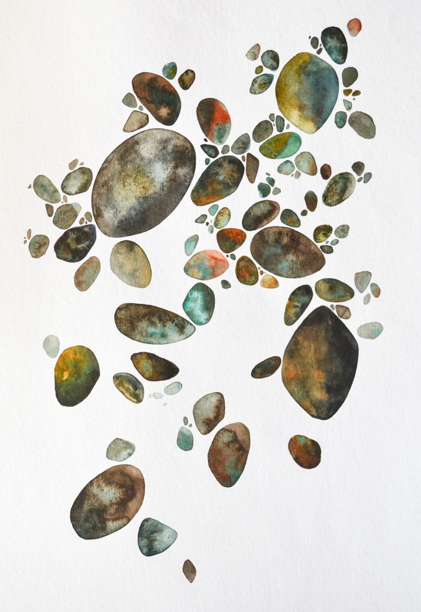
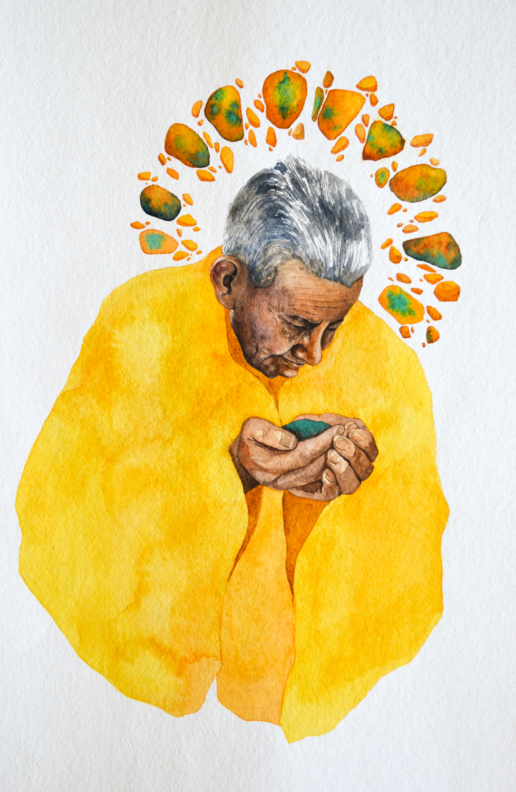
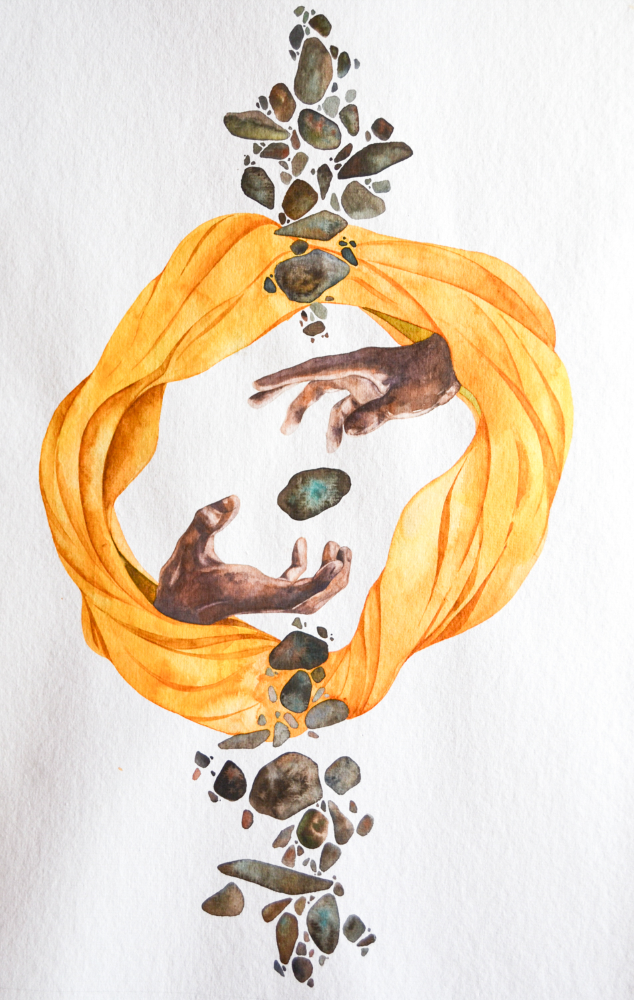
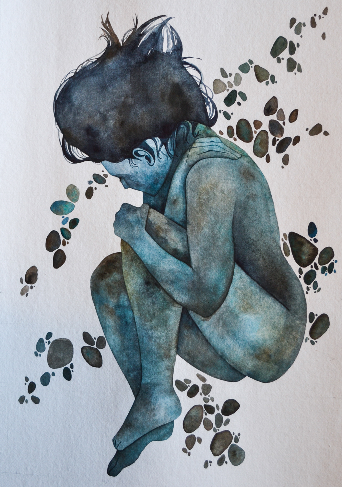
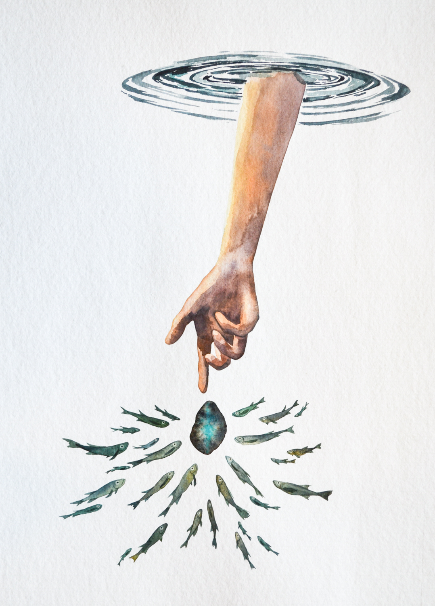
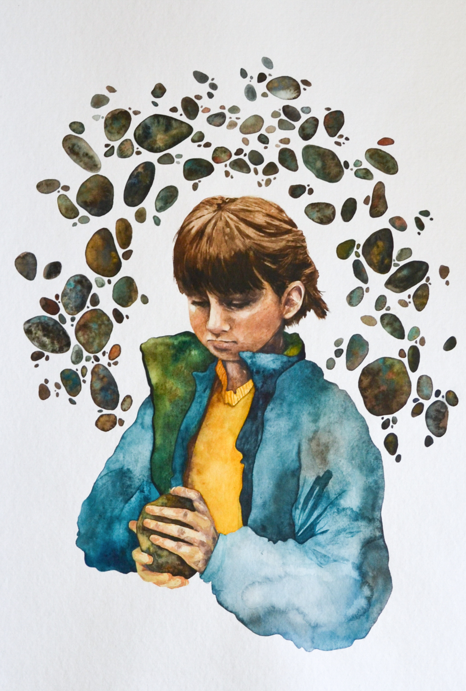
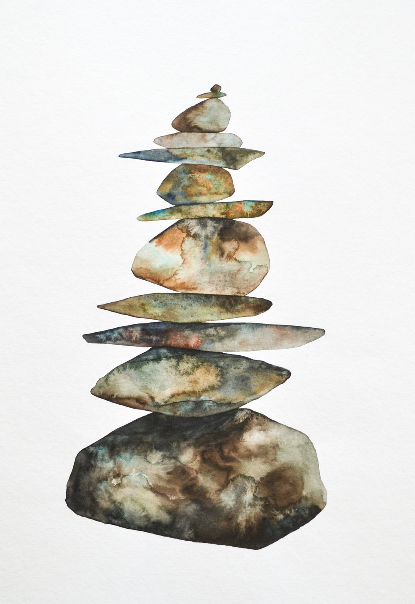

 
  

_There were bodies of water that we crossed_  
_Quarries that were scavenged_  
_And memories that I excavated_

​

### My work depicts the transformation of a traditional Andean Creation myth into a personal narrative of my own through a series of watercolor paintings.

The original myth begins with the deity Viracocha emerging from a great void and then crafting the universe. Soon after shaping the Earth he decides to create its inhabitants by blowing into stones, thus giving rise to humanity. After wandering among his creations for a time, Viracocha enters the sea, dissipating into foam.

Using this myth as a template, I explore my Andean heritage by utilizing the strong visual imagery of stones throughout the story to express the fragmentation of memory and culture and to finally suggest the need for balance in the search for identity.

The first few paintings in my series introduce Viracocha, modeled after the image of my _abuelito_ (grandfather), entering a desolate landscape inhabited only by a myriad of stones. The stones in my paintings represent humanity; each stone is an individual, a physical weight to be passed down. The stones themselves are painted in various earthy and vibrant tones, juxtaposing against the bright and ethereal presence of Viracocha whose yellow poncho is reminiscent of a radiant sun. With careful precision, he chooses one stone among many to give life to, and from his breath, the stone takes on a more lively blue color and gradually resembles the shape of a human. Near the end of the series, this stone transcends time and legend to land in the hands of my child self, who after considering the stone, finds potential in it and decides to put it into balance among other collected stones. This cycle of both shaping and acknowledging one’s cultural identity repeats.

