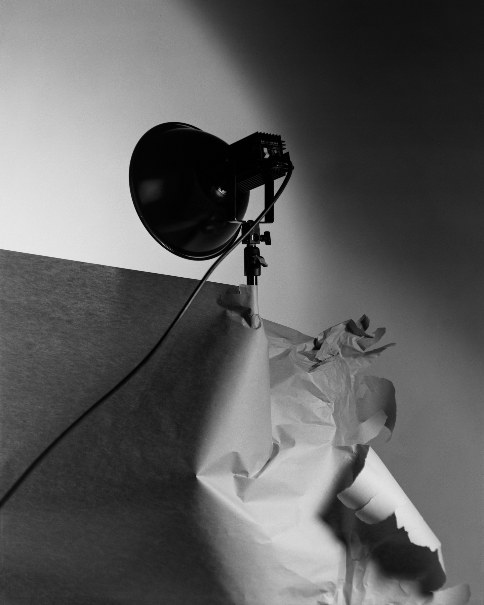
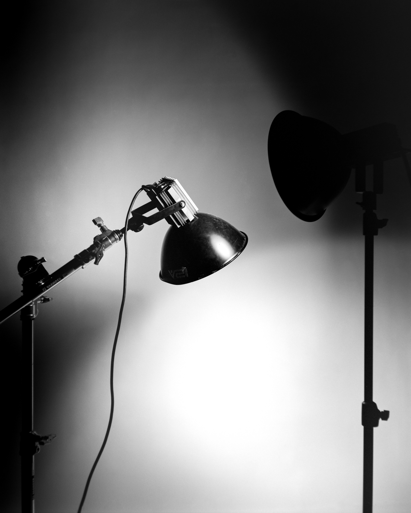
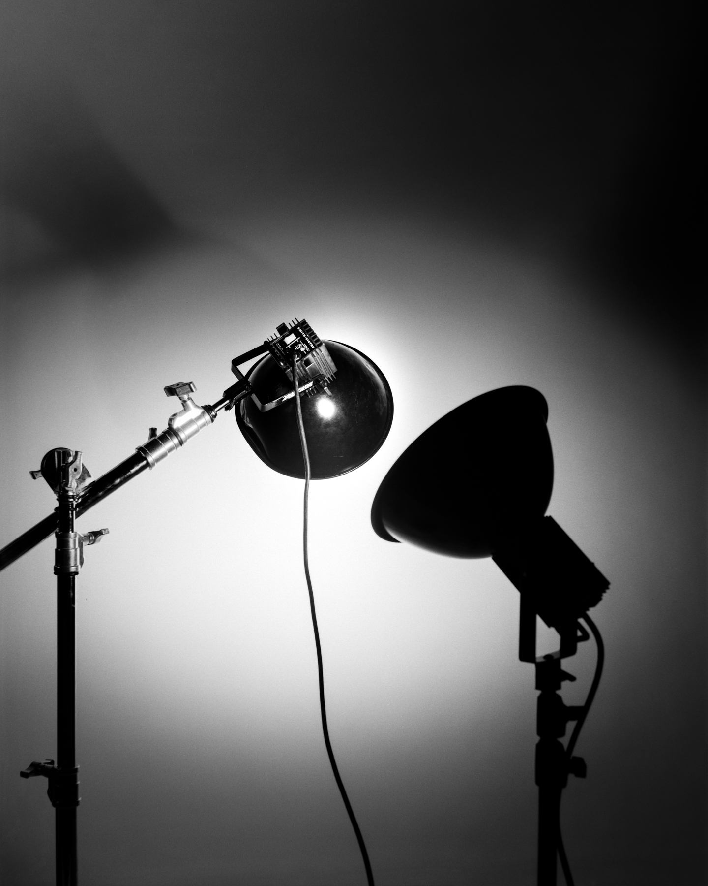
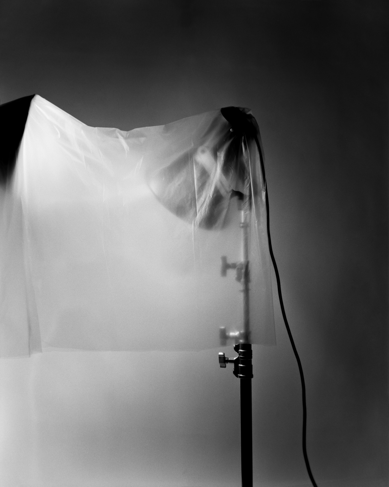
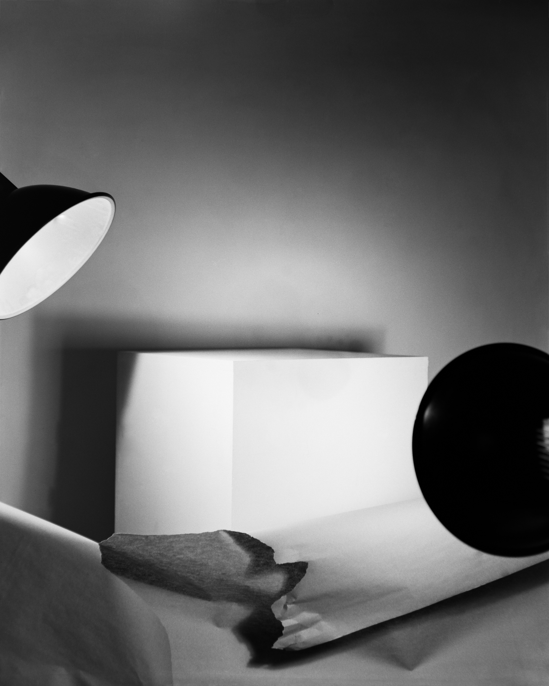
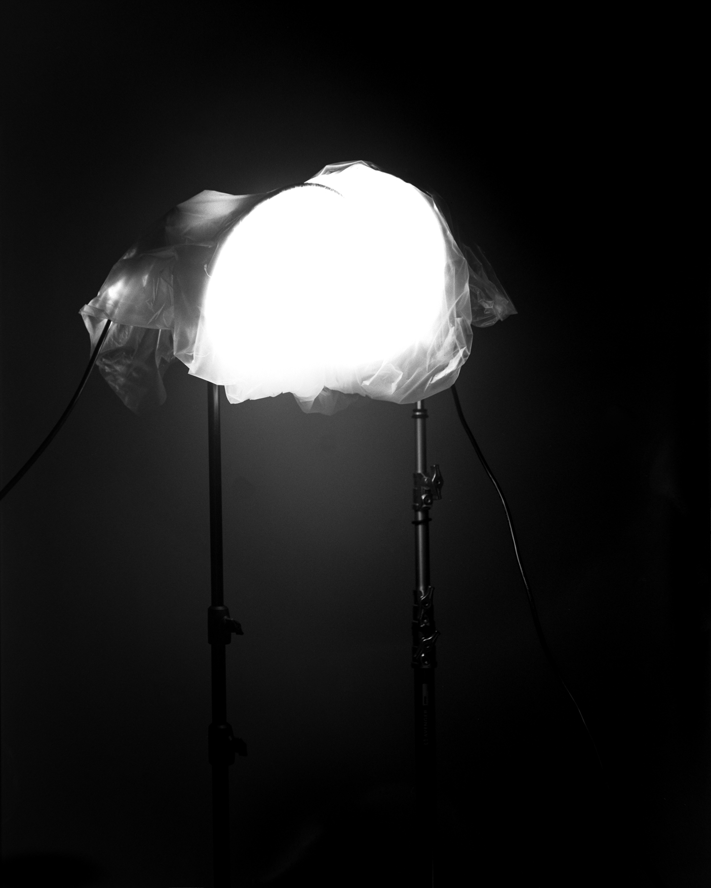
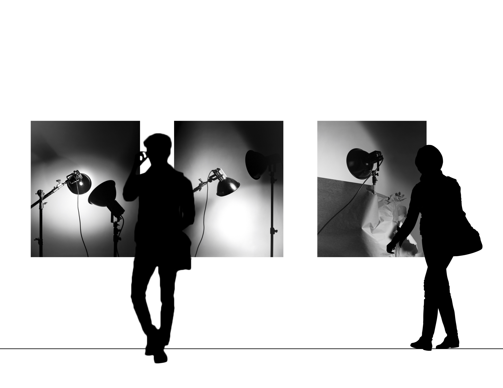

### In retrospect, my art practice has been a meditation on control.

By focusing on what is usually off camera, Lit references and celebrates the highly constructed, controlling and controllable nature of an artistic practice. This series, and these objects, are an exploration of my longstanding preoccupation with imposing order by exerting control. My preference for darkroom photography was likely an attraction to an environment where all things were "testable" and had the potential to achieve technical perfection through exacting measurements. By choosing to print at an unusually large size, I intensified the existing challenges of controlling not only the resulting image, but the variables of the darkroom process. The exercise of making these prints, themselves objects, became a significant part of this project. I was required to construct and repurpose equipment to create outsized prints with the degree of control over the tonal quality and texture I wanted to achieve.

Lit humanizes the studio lights by focusing on the relationship among the objects in the frame. My objective was to control both the image and the impact it has on the viewer. No longer fixtures, the light wrapped in butcher paper held together by a delicate piece of tape suggests a gowned woman; a torn sheet of paper alludes to something broken; two lights face away from the viewer, a plastic sheet, referencing a desire for privacy.

I have gone from appreciating the control involved in the photographic process to making the process of control the actual subject of my work.

Gallery Mockup

