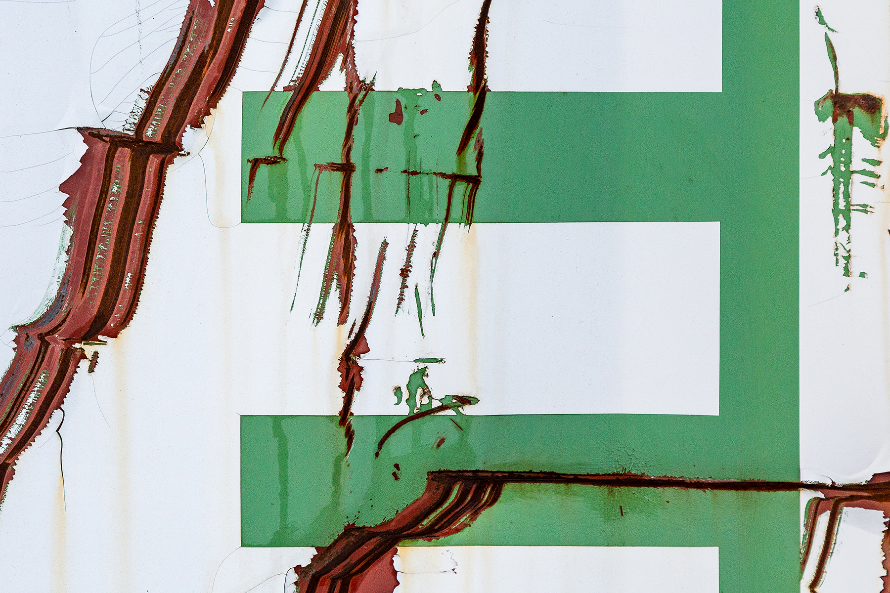
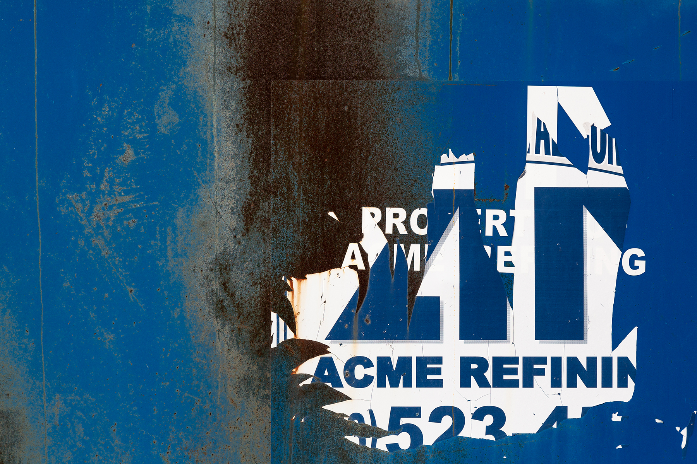
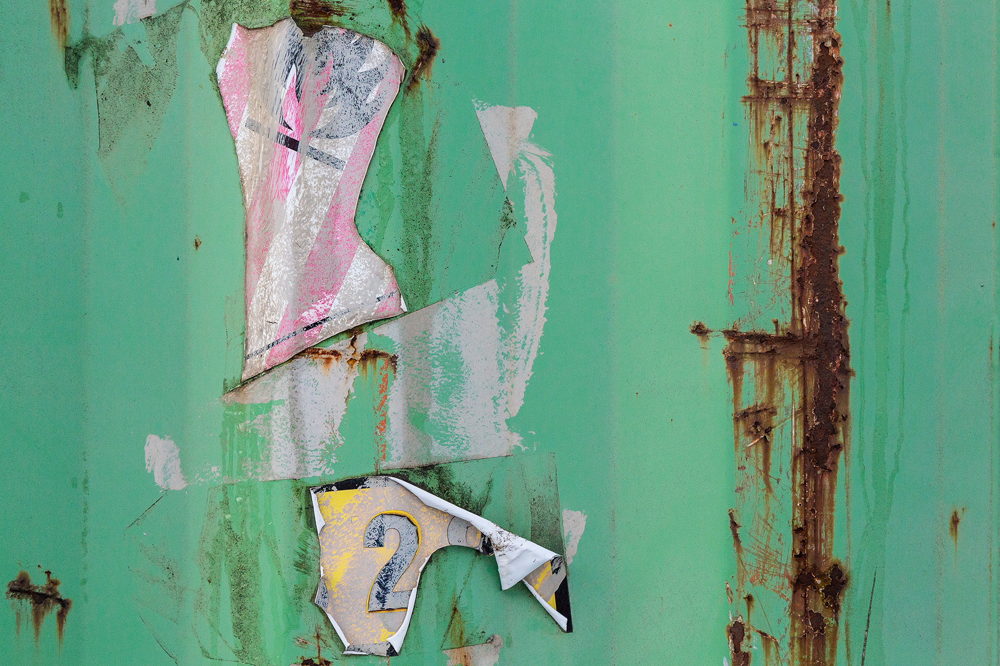
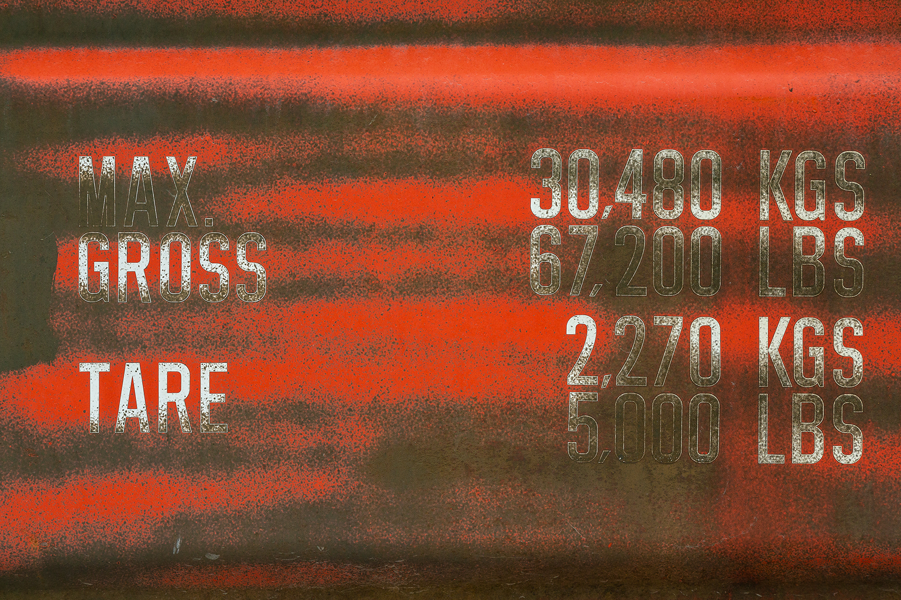

### My motive in making these photographs is for the imagery to be seen and understood at face value, for what they are. Rather than an articulation of abstract artistic vision, my subjects all have a utilitarian nature.

This quality reflects a tenet of “Complete Reality Taoism,” which can be visualized through the 64 hexagrams of the ancient Chinese text, the *I Ching*. As I drove across the Ohio countryside and into small towns and cities, I searched for graphic elements such as the name of a specific location, graffiti, a business logo, a phone number, a numerical code. Each of these identified persons, companies, or places beyond themselves. These graphic elements therefore have the same symbolic power of the 64 hexagrams. Like the hexagrams, they are utilitarian. They do not have value in themselves, but in how they point to realities beyond themselves.

Viewers will also find in my work objects and surfaces which are visibly torn or sheared, marked with abrasions and rust, or covered in some kind of dirt or grime. To me, these elements refer back to the utilitarian quality of my subjects, making clear that they are grounded in time—they have been well used. This gives the subjects the kind of beauty which is not created--but found, and witnessed.

