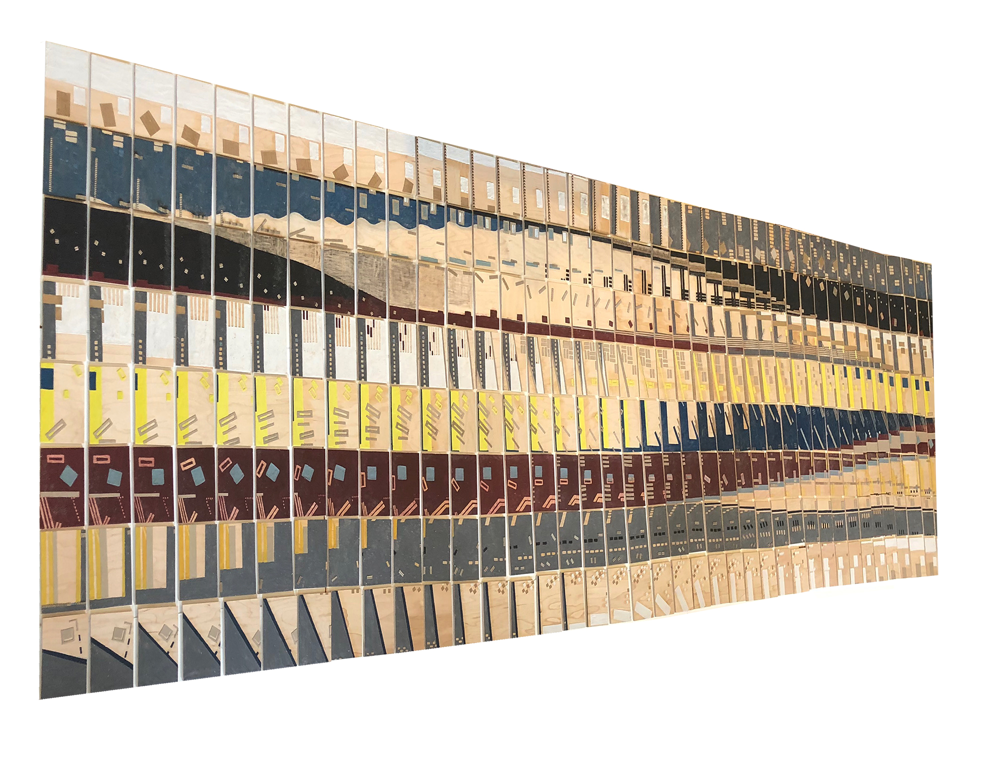
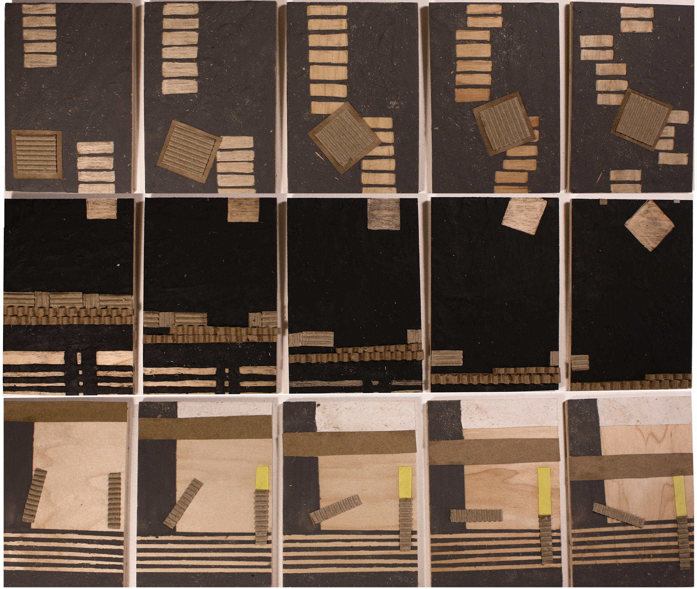
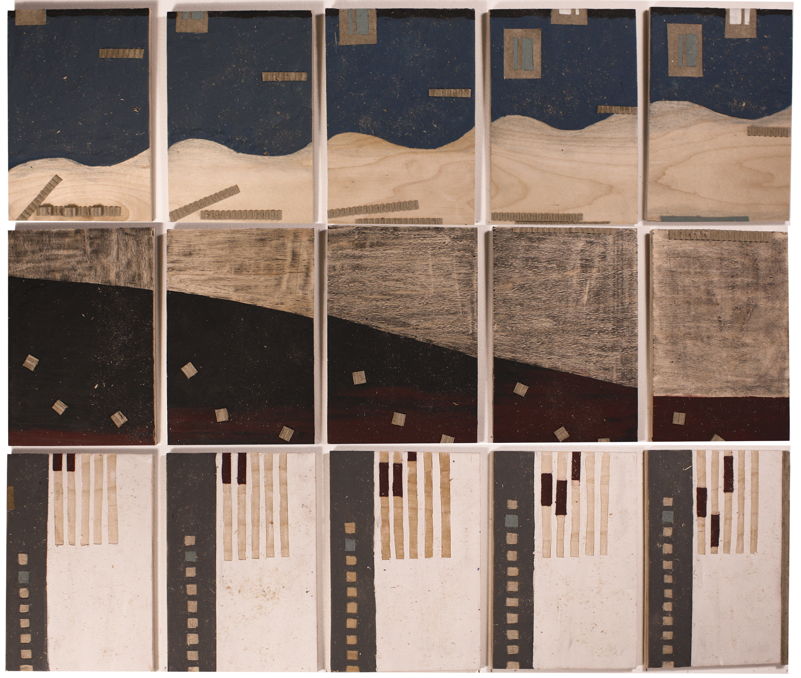
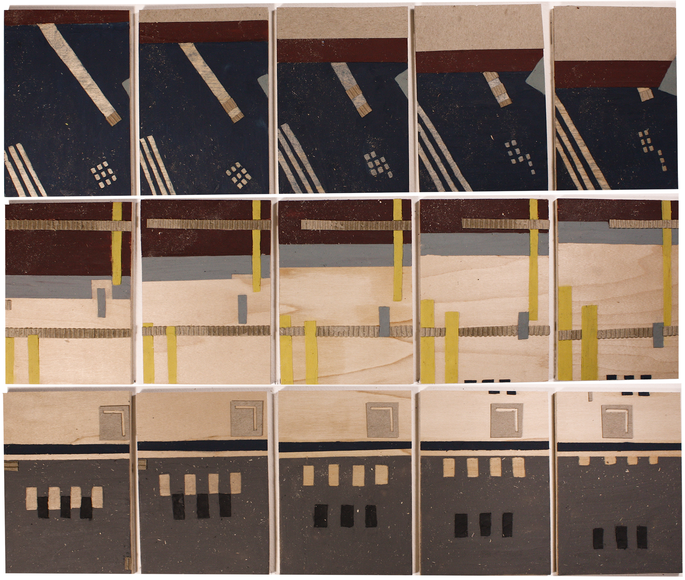
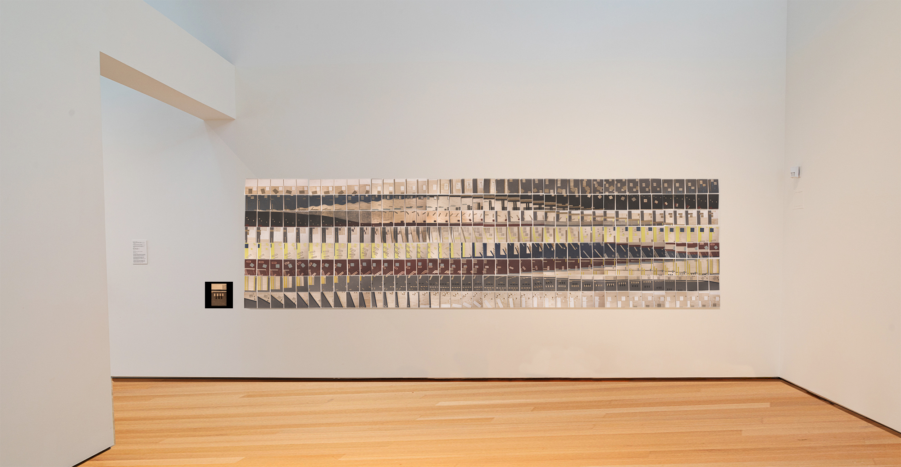

### My work examines the interaction of repetition, color, and motion through a series of 320 mixed-media multiples.

Each piece in the series builds off of the previous one with a slight change in form, motion, and color. In this way, I present a stop-motion sequence, frame by frame, in a deconstructed, physical form. Additionally, I present a continuous, animated film of the same deconstructed series, so that the viewer is able to compare the way they process movement and find meaning in an abstract sequence. By presenting a series of physical frames alongside an animated film, I eliminate the viewer’s distance from the creation process and allow for a more interactive exchange between artist, artwork, and viewer.

The exploration of repetition and patterning in this work demonstrates my methodological approach to creating. I explore and play with material in an open-ended, improvisational manner, emphasizing my interest in process and unstructured ideation. I choose to use a number of commonplace materials: oil-based clay, cardboard, paper, dirt, and sawdust to draw attention to the everyday objectness of my work. Through the use of these materials, I investigate texture and my personal way of mark-making, embracing my role as the maker. The fingerprints and the flicks of sawdust from frame to frame reference the quality of early animation techniques and highlight process and imperfection. Through this final piece, I hope to show the value in my method of creating and push the viewer to consider their own way of processing art and the patterns of form, color, and motion in the world at large.

`video: https://vimeo.com/410868224`

Gallery Mockup

