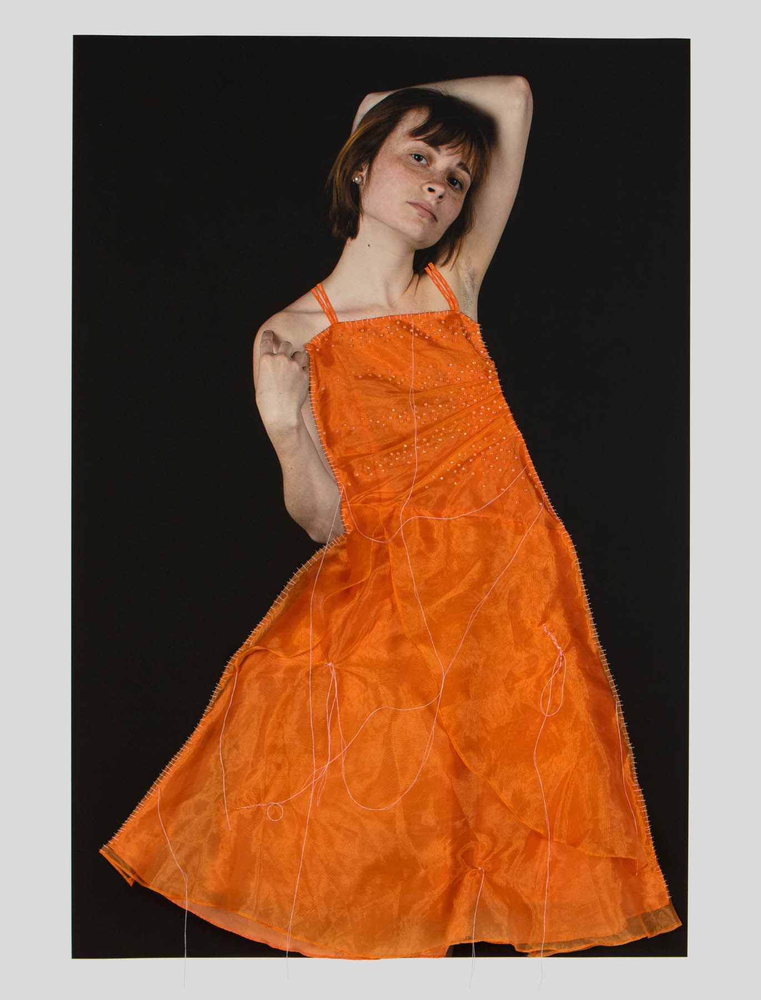
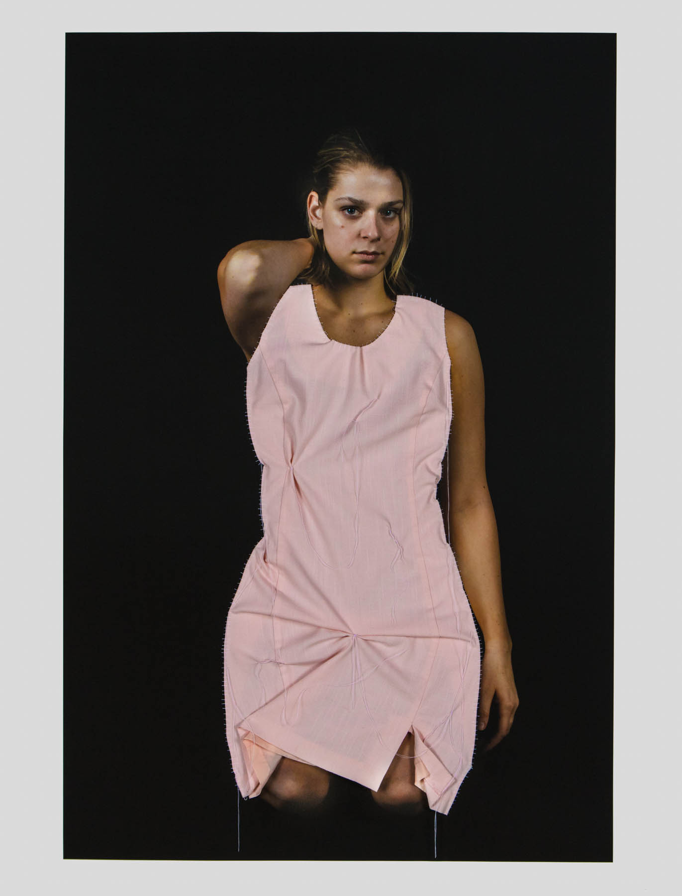
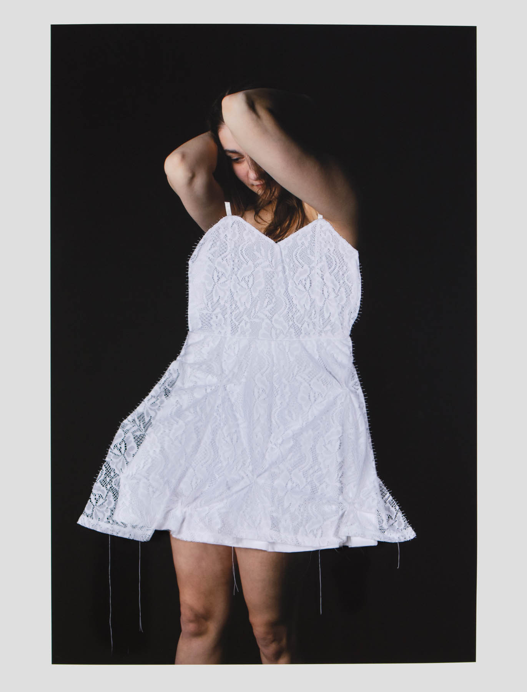

### A common thread throughout childhood is the use of toys.

Though they may seem insignificant to any adult who once held them, the toys we played with blindly as children are key elements in the establishment of gender bias in American culture.

Orange Dress

For years, young girls have been taught enforced stereotypes of femininity, dressing their dolls up in specific clothing and portraying their lives in a specific way. _All Dolled Up_, my series in which recycled dresses are permanently sewn onto photographs of women, hones in on the psychology of American gender norms, and in particular how childhood influences create ideological permanence in adulthood.

Pink Dress

My stitches in this work are hand sewn; the thread is crooked and uneven. Humans define culture, and it is our culture that has produced these perceptions. Like the dresses in this work, these ideas have become permanently affixed to our view of the world and change the way we look at femininity and each other. It has forever become a part of the way these women are being viewed and the fabrication they have been decorated with.

Green Dress

However, like people, these images and the stigmas they carry are changing as Americans challenge this understanding of gender. As depicted by the dangling thread, and tears throughout the dresses, these once well-established seams are coming apart, pulling these cultural stigmas away from the women who once carried them.

White Dress

