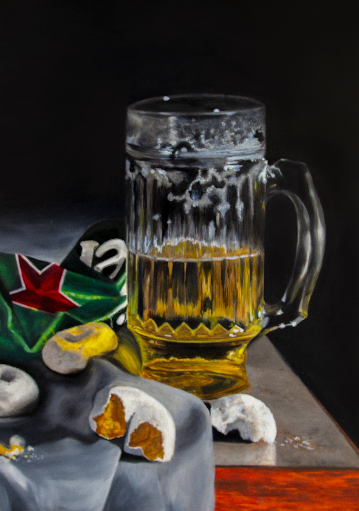
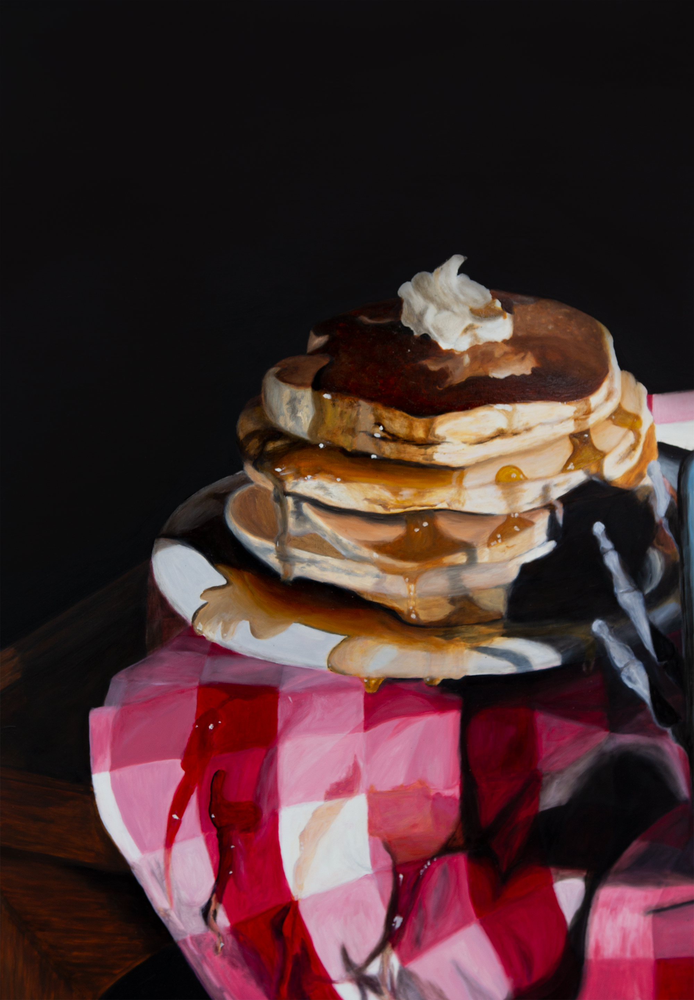

### With this body of work, I seek to forge a connection between the history of still life painting and contemporary young adult culture.

Through placement of objects and style of rendering, I play with shock value and cultural understanding to construct a humorous interpretation of youthful lifestyles in the era of Postmodernity.

Still Life with Bong, Donuts, and Heineken

Drawing inspiration directly from 16th-18th century Dutch still lifes, I take traditional elements such as draped cloth on wooden tables, foodstuffs, and vessels, and transform them into objects and symbols that are widely understood in today’s world. The smoking still life, or _toebackje_, becomes a bong, Budweiser, and mini powdered donuts (for the munchies). A gluttonous stack of pancakes depicts the breakfast scene, or _ontbijtje_, while adding new elements of technology and a skeletal reminder of the inevitability of death. Lingerie, red wine, the post-coital cigarette, and of course, oysters, play on the symbolism of debauchery that classic examples warn against (or perhaps facetiously encourage).

Still Life with Pancakes, Syrup, and iPhone

The quality of my painting is also a nod to the realism of Haarlem style paintings, though pushed deeper into photorealism. Working in this style provides an opportunity to create a certain seductive quality, so enticing that the viewer cannot help but want to touch. At the same time, the work should feel stylistically in touch with the subject matter. Religious or moral themes, often present in earlier still lifes, could possibly translate here too, though if anything, I satirize the concept of judgement rather than the behavior itself. As such, I present this work as a portrait of society, not a prescription of how to live one’s life.

Still Life with Oysters, Lemon, Cigarettes, and Calvins (detail)

Still Life with Bong, Donuts, and Heineken (detail)

Still Life with Pancakes, Syrup, and iPhone (detail)

