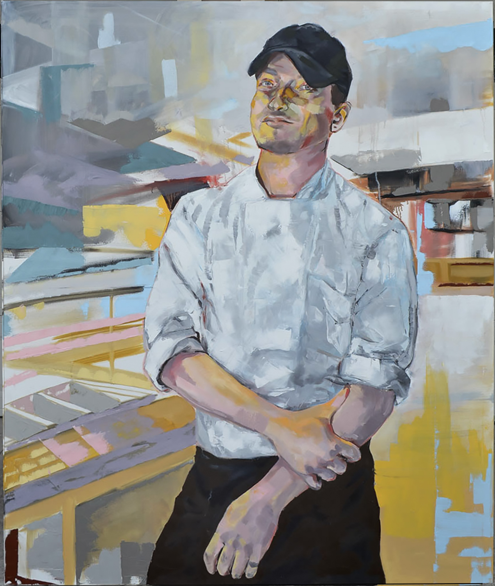
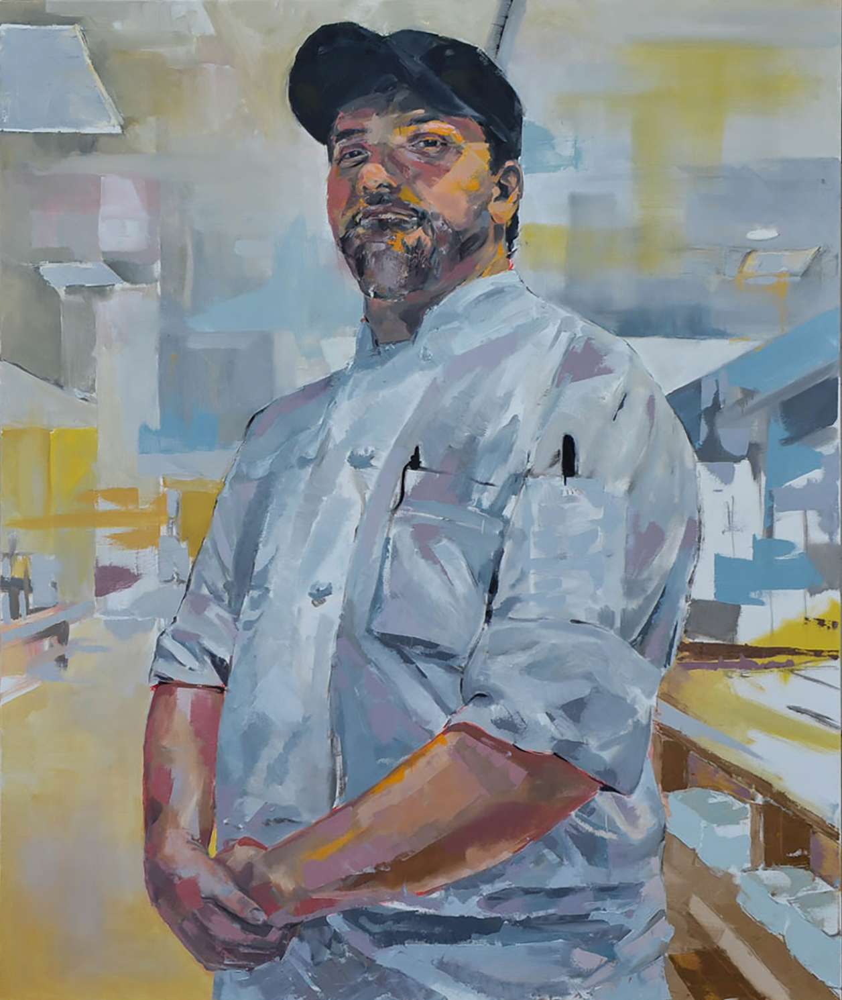
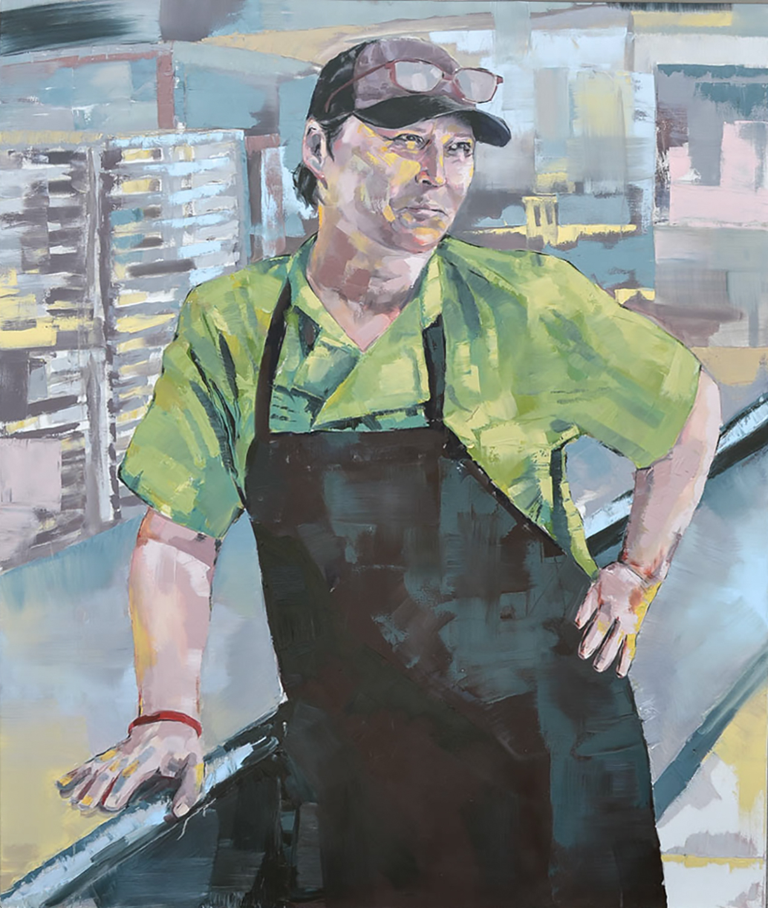

### The three people depicted in this series have prepared and served me breakfast, lunch, and dinner for four years. When I see them in the dining hall, I greet them warmly, but beyond the occasional hug, the encounters I have with them occur on opposite sides of a plexiglass sneeze guard and on opposite sides of a workday/school day divide. 

Mike

I recognize the opaque nature of my relationships with Ed, Mike, and Lisa, and yet I also must acknowledge the deep connections I feel with them. Through these portraits the viewer will be able to get a sense of the complexity of these important yet largely overlooked relationships that many of us have throughout our lifetimes.

Ed

In creating these portraits, I highlight the visual texts of Ed, Mike, and Lisa’s hardworking hands and open faces. Seeing their forms wrapped in new colors and painted with broad, confident strokes, I hope the viewer will gain an understanding of the warmth between this painter and her subjects. In an open letter to Kenyon’s senior class, Lisa wrote that she wishes she could “protect and take care of each and every one [of the students she sees],” and that her enthusiastic greetings are how she makes “her kids” feel seen and loved. I anticipate that these paintings will convey how very much the presence of these three people in my life has meant. With gratitude, friendship, and deep respect, I dedicate this series to them.

Lisa

