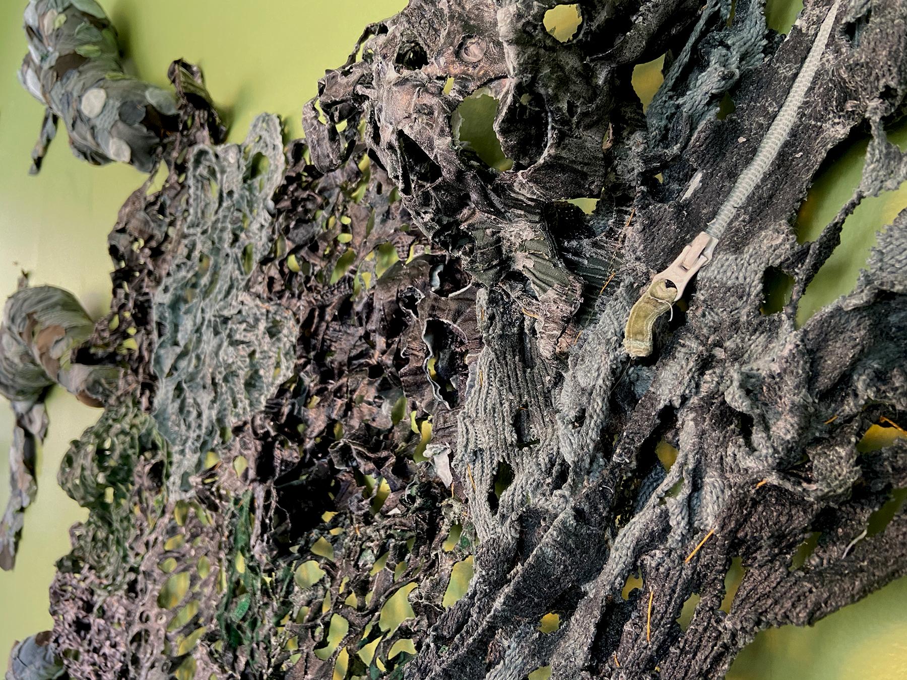
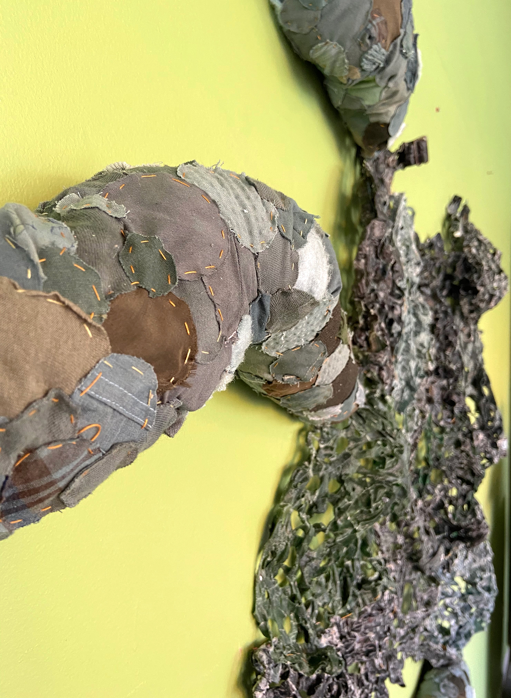
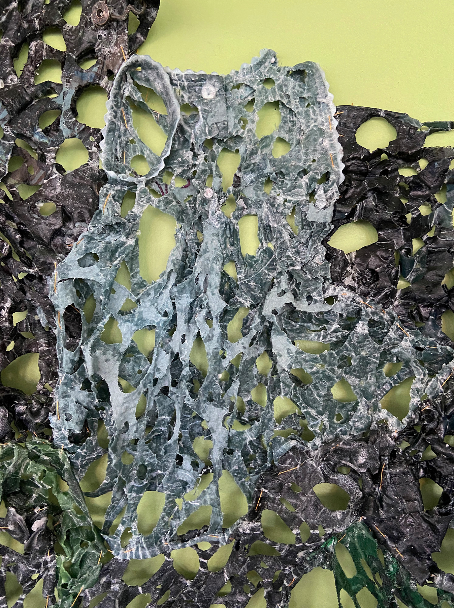

<!---
INSTRUCTIONS: Fill in the Frontmatter (above) with the artist's relevant information.
Then copy in their artist's statment and images. Put a '###' in front of a line for big text, as demonstrated below.
For full width images, make sure you put each one inside its own set of Div tags (also shown below).
Re-order text and image below this comment however you want it to appear on the actual site
(do not change the placement of the Frontmatter!)
The Description is for SEO, so what shows up on and will inform Google Search results. Keep it short!
-->

### My art is an extension of the natural world and manmade materials that have become a staple in our lives.

Clothing is, at its core, protection from outdoor elements but has transformed to become a code of one’s identity in society. As a result of clothing and farming industries, algae blooms have begun to take place in our natural freshwater sources, tainting the water and making it unusable.

Ohio, where I live, is home to many cotton processing plants and fabric manufacturers for the textile industry, as well as thousands of farms using fertilizers and raising livestock. Two of the largest runoff wastes from textile production are ammonia and nitrogen, and the leading runoff from the agriculture industry’s fertilizer also is nitrogen. This excess nitrogen leads the algae to multiply rapidly, like a cancer, sucking all of the oxygen and life out of a body of water.

I bore out holes in children’s clothing as a parallel to the oxygen being taken out of their future water supply. The boring of the holes is significant as I hope to replicate the cyanobacteria or blue-green algae and its circular microscopic shape on a magnified scale. The tiny circles from the clothing have been sewn together to form the crawling cancers, growing outward on the wall, in the shape of the Western basin of Lake Erie, one significant locus of this environmental crisis.

