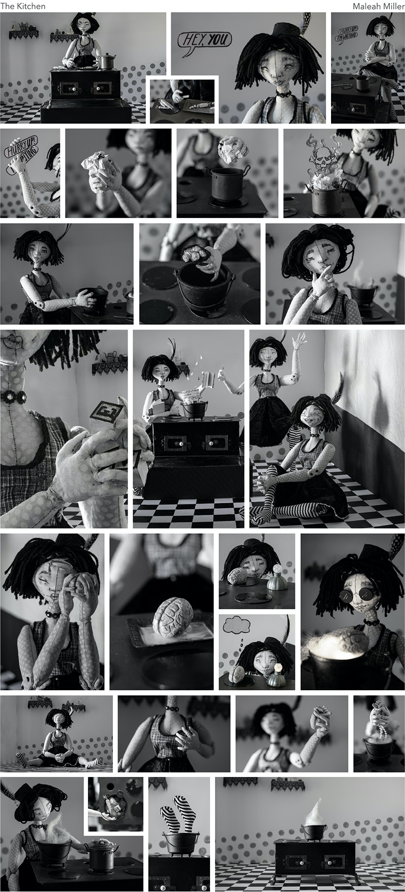
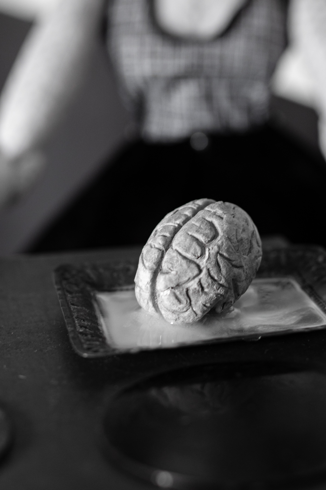
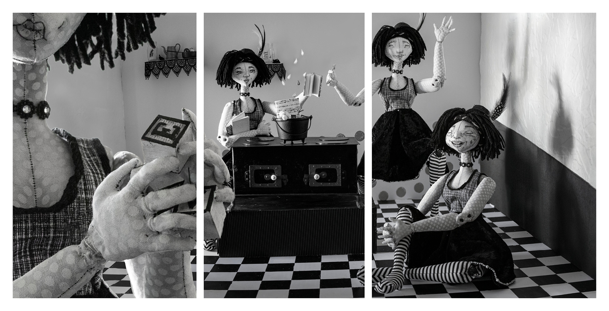
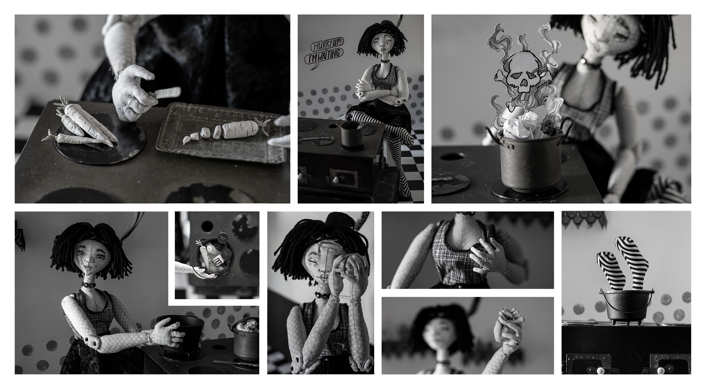

<!---
INSTRUCTIONS: Fill in the Frontmatter (above) with the artist's relevant information.
Then copy in their artist's statment and images. Put a '###' in front of a line for big text, as demonstrated below.
For full width images, make sure you put each one inside its own set of Div tags (also shown below).
Re-order text and image below this comment however you want it to appear on the actual site
(do not change the placement of the Frontmatter!)
The Description is for SEO, so what shows up on and will inform Google Search results. Keep it short!
-->

### I grew up playing with dolls, and in my current artistic practice doll-making embodies both the construction and the condensation of personhood.

Dolls look like us, but are different enough from us to be a perfect (and sometimes literal) canvas through which we might understand ourselves better.

This particular photographed doll, crafted in homage to fiber artist Patti Medaris Culea, is handmade of dyed cotton batik, and her kitchen, a hub of symbolic creation, is built from cardboard, paper, and found antique toys. The black and white color scheme alludes to early silent films and to the stark ink and paper of classic newspaper cartoons, lending an exaggerated, illustrative air to real-life objects. The resulting aesthetic is domestic and surreal, playful and peculiar-an ode to the creative and destructive power of imagination. Each photograph becomes a panel in the final comic page, which I arrange digitally, and together the frames resemble a strip of photographic film, providing glimpses into a constructed life that resembles our own in form as well as feeling.

Even a perfectly finished comic or sculpture retains marks of its production, with ink strokes and seam lines preserving forever the marks of their makers. This evidence of past creative labor suggests the possibility of future re-creation and destruction, and through this project, I invite the viewer to imagine the ability we all have to craft new versions of ourselves and of the world we share.

