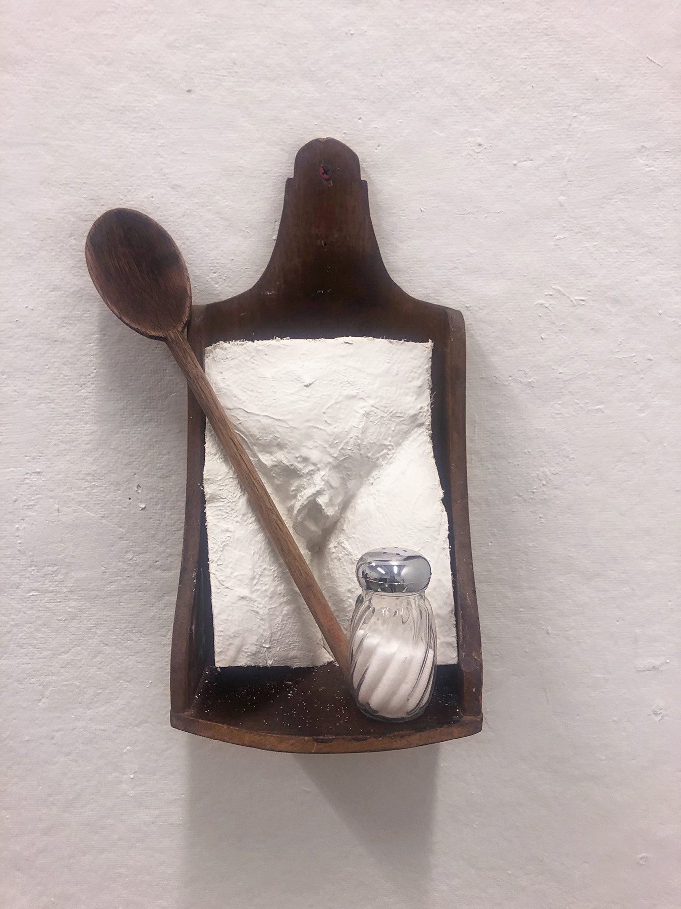
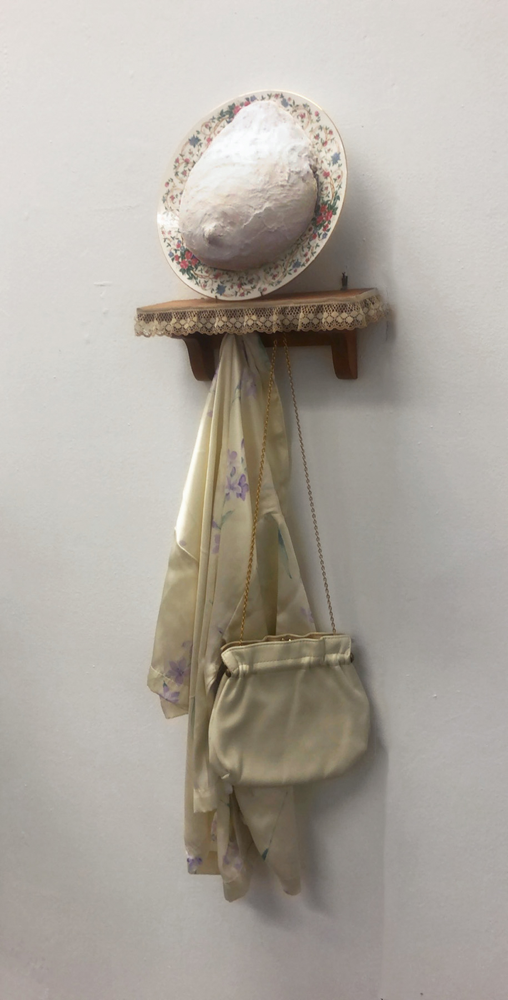
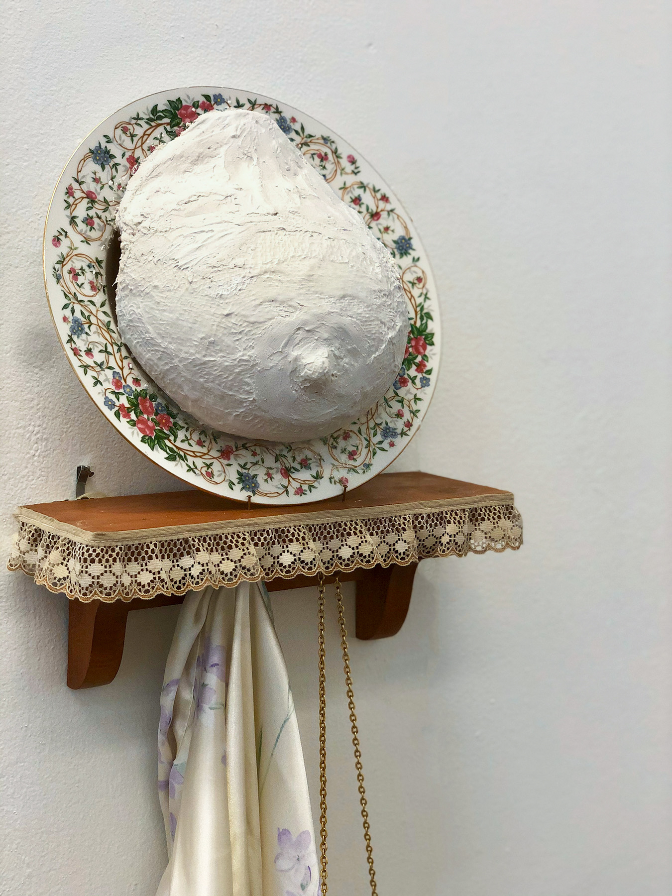

### ​The objectification, consumption, and fragmenting of women’s bodies we witness on a daily basis fascinates me.

Almost every ad that contains a woman shows only part of her body. The woman relinquished relinquishes individuality, becoming a dividual. The gaze fetishizes and obsesses over body parts that are commonly sexualized, like the torso, breasts, buttocks, vagina, lips, or back. 

Fragmenting women turns them into manageable parts. It allows the viewer, or me, the artist, to become a dictator: there is no talking back, no conversation, only the function you have enlisted the object to serve. Sculptural collage allows me to display the ‘bite- sized pieces’ of women we see in the media in surprising yet familiar ways to my viewer, making the lack of wholeness observed when we view the female body evident.

I use plaster sculpture to create female bodies, juxtaposing them with antique objects. The woman’s women's skin is treated in a variety of ways, sometimes left to closely resemble the skin of the woman, or treated to resemble the otherwise banal object. By using objects that the viewer already has preconceived ideas about or understanding of, and sexualized body parts understood through the internalized gender binary, I can strengthen and change the connotation of both body part and object.

I hope that my work causes viewers to question their own consumption of women’s bodies, and their participation in the enforcement of binaries that allow it to occur in both obvious and discreet ways.

