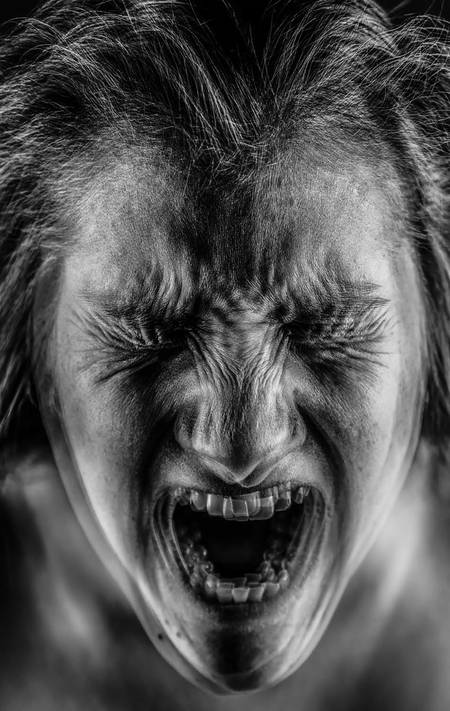
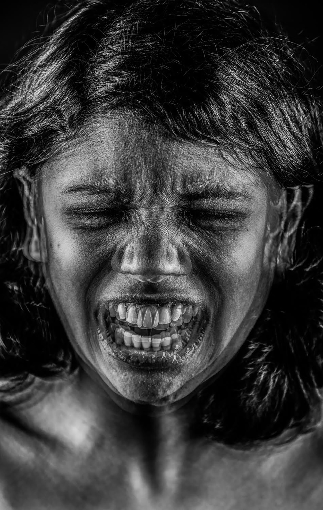
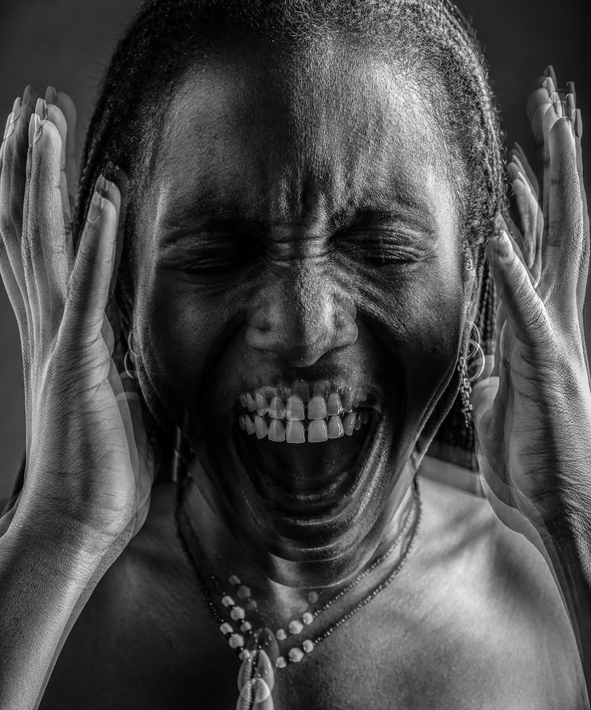
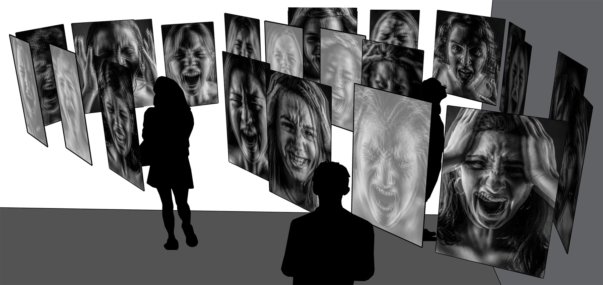
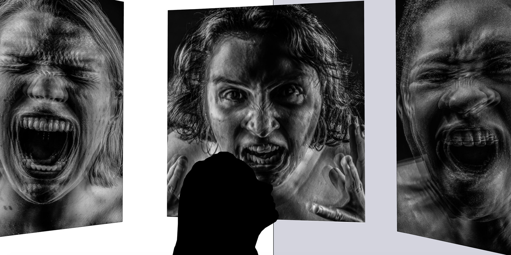

### SCREAM.

Scream at misogynists. 
Scream at the patriarchy. 
Scream at the men who objectify and sexualize and infantilize women. 
Scream at the men who reinforce the wage gap and glass ceiling.  
Scream at the men who restrict women’s reproductive rights and freedoms. 
Scream at the men who sexually and physically and domestically abuse women. 
Scream at the men who reinforce the male gaze and male privilege. 
Scream at Trump. 

Women are not allowed to be angry. If we stand up, talk back, get angry, cry out, we are told: sit down, shut up, calm down. We become unattractive, unladylike, overemotional, bitches, cunts. _SCREAM_ celebrates female anger and condemns sexism. 

In this series, I photograph my female friends and myself ferociously screaming and install these photographs as a maze; I encourage these women to embody anger, scream at sexism, and gain agency through this emotional catharsis. Each woman collectively constructs the maze’s walls and dictates the viewer’s movements and emotions. Throughout the maze, I install speakers with audio recordings of men whispering President Trump’s 2005 _Access Hollywood_ comments about his assaulting women.

As they navigate deeper into the maze, the viewer is lost and trapped in a dead end, surrounded by screaming women and the whispering of Trump’s comments. At this end, the viewer must confront how they simultaneously oppress women, especially women of color, and benefit from their own privilege(s) and sexism. As the viewer exits _SCREAM_, I encourage them to remember our anger and act daily towards gender equality.

