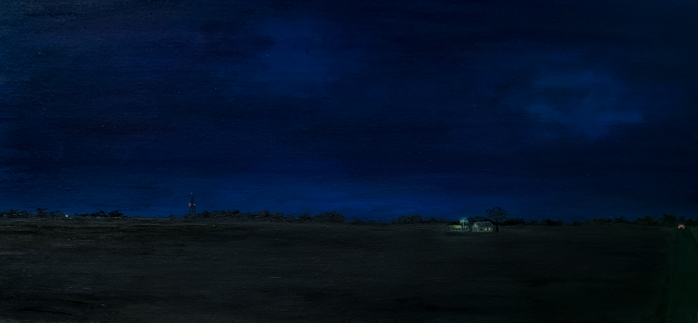
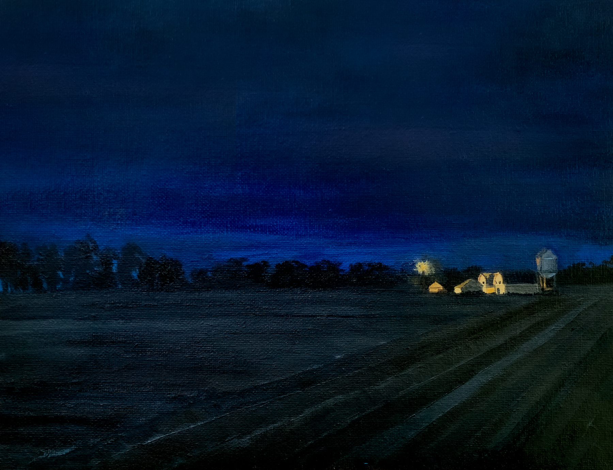
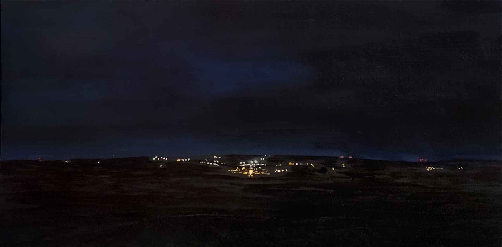
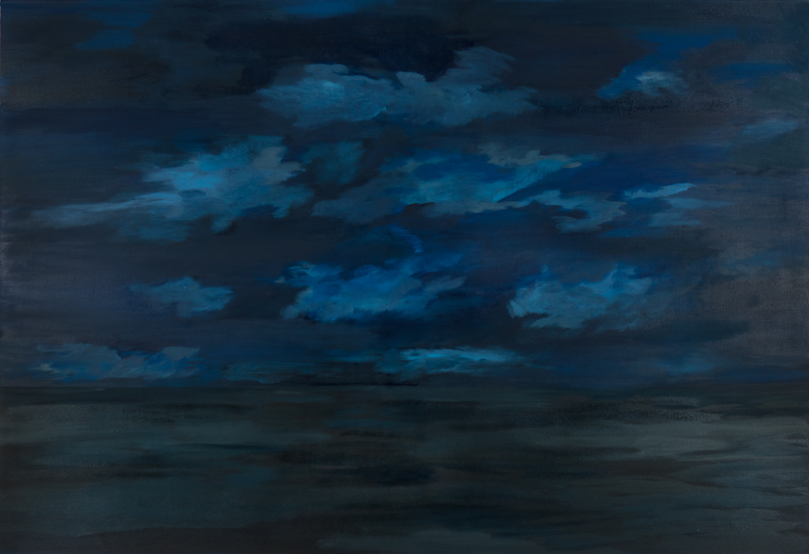
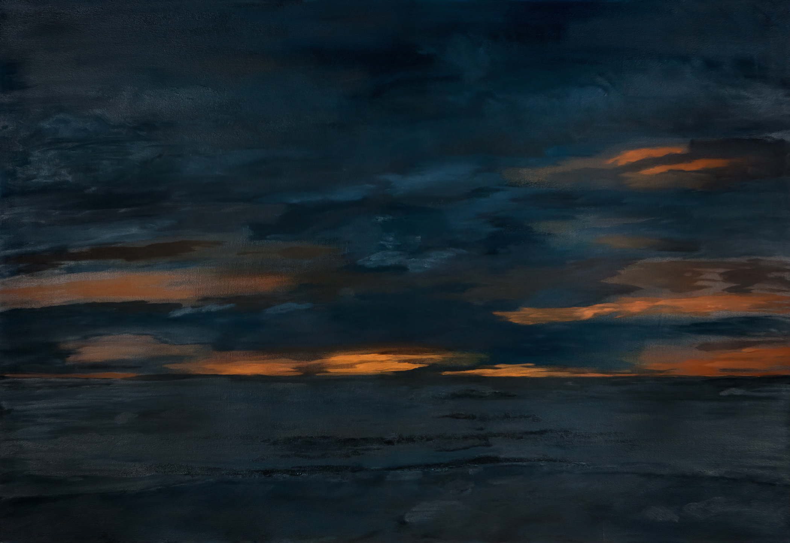

### My series invokes the childhood experience of looking out across a vast open space, seeing smudges of moving lights, and realizing in awe that behind those lights, humans the size of me were living and existing in days as big as mine. 

6:43 15" x 30"

From a distant vantage point, I paint landscapes near highways and busy roads in Ohio that are often driven past without pause. In part, I am interested in the potential narratives that the tiny marks in my paintings evoke. They represent potential interactions and private scenes in homes inaccessible to us. Since I am not from Ohio myself, the distance from which I paint also registers my passing visitational relationship to these intimate scenes. 

7:42 9" x 12"

The night creates an immense encroaching sense of quietness. Night quickly de-familiarizes and mutes places otherwise comfortable and routine to us. Only when we sit with this obscuring darkness, slowly we begin to register the range of color
contained within a dark sky. 

9:30 8" x 16"

Now living in isolation, separated from my original paintings, the significance of this body of work has evolved. Not only do I feel a deep sense of loss for the work itself, but also for these disquieting open horizons which I revered throughout my time in Ohio. Carrying this project forward, and repainting a landscape series on smaller canvases, my scenes mimic how the world has gone quiet in light of this pandemic. We are secluded in our isolated spaces, physically anchored away from one another, while the natural world continues forward.

8:45, Interrupted 60" x 41"

9:30, Interrupted 60" x 41"

